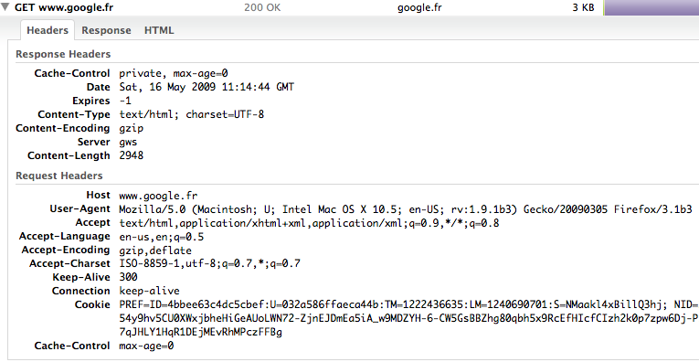
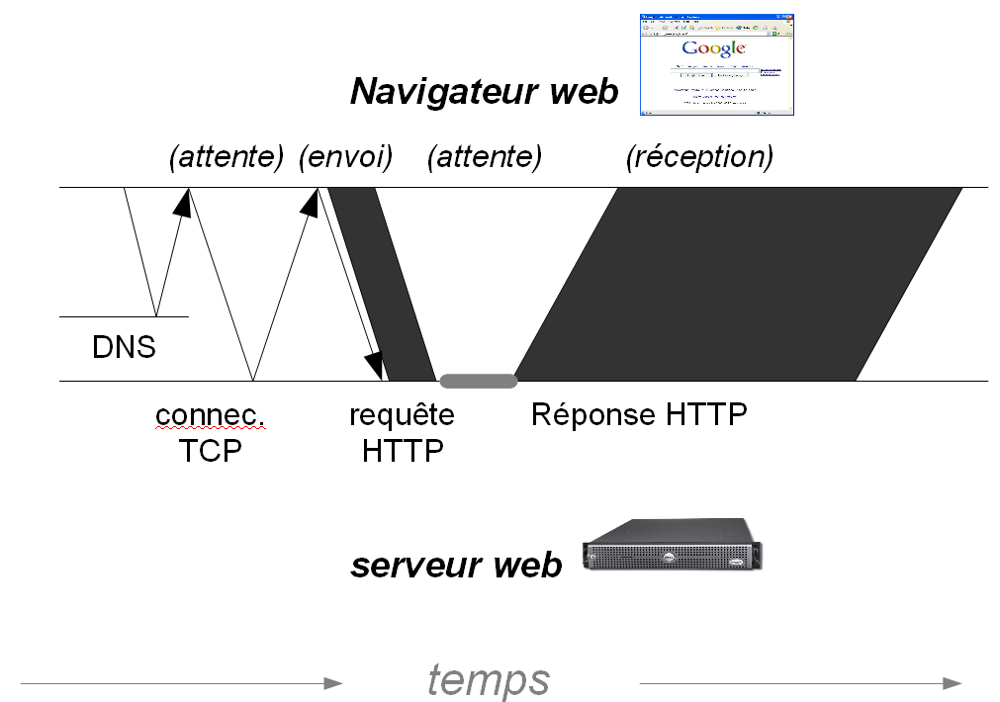
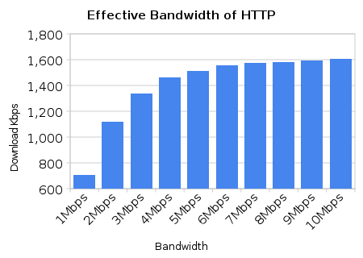
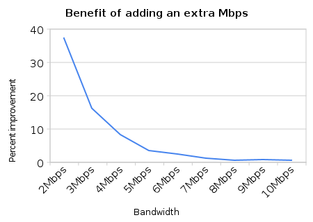
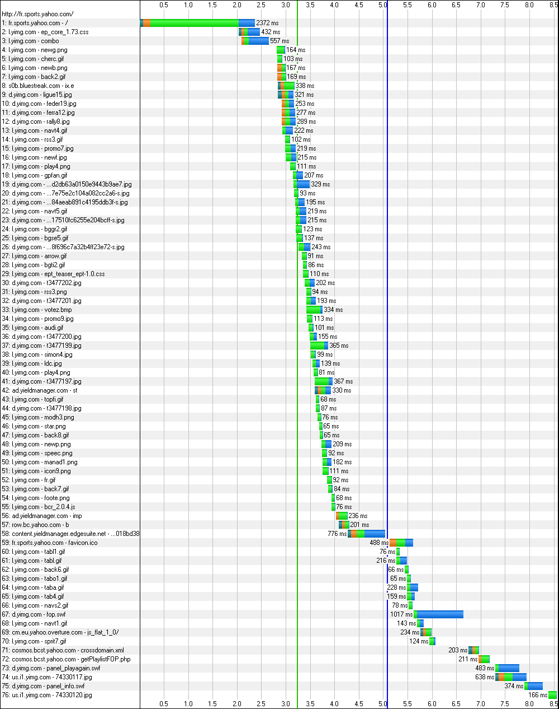
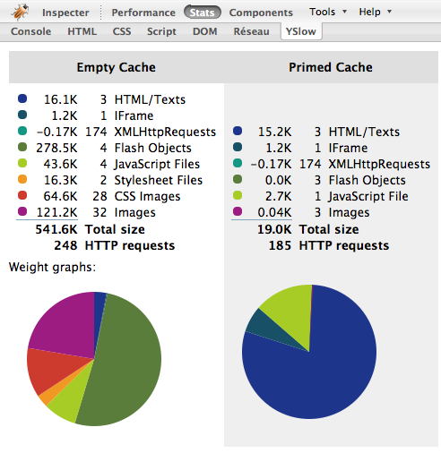
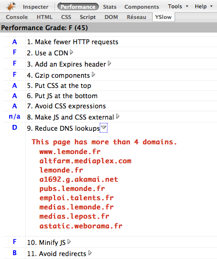
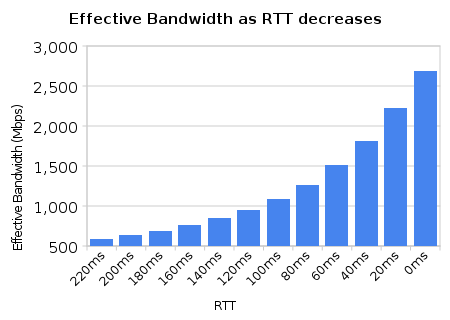

Premiers concepts
=================

Avant d’entrer dans le détail des recommandations et du travail 
à réaliser, il est important de comprendre ce qu’il se passe entre 
le navigateur et le serveur web. Vous connaissez peut-être le 
principal mais jetez tout de même un œil attentif à l’analyse 
réseau. Il y a de nombreux points sous-estimés qui méritent votre 
attention. 

Composition d’une requête HTTP
------------------------------

Le protocole utilisé par le navigateur web et le serveur web s’appelle 
HTTP : HyperText Transfer Protocol. Il s’agit d’un protocole 
simple à comprendre, basé sur des lignes de texte et des associations 
clef – valeur. 

La première particularité de HTTP est d’être un protocole dit 
_stateless_, sans état. Il n’y a en effet qu’un seul échange : 
le navigateur envoie une requête puis attend la réponse du serveur. 
Il n’y a aucun autre échange entre les deux intervenants. Lorsque 
le navigateur demandera une seconde ressource (ou rechargera 
la même que précédemment) il fera une nouvelle requête, indépendante, 
sans aucun lien avec la première. 

### Exemple de requête HTTP

Une requête du navigateur au serveur est constituée de trois 
parties : la ligne de requête, un bloc d’en-têtes, et éventuellement 
un bloc de données, le corps de la requête. 

~~~~~~~ {.http .request}
GET /index.html HTTP/1.1
Host: example.org
User-Agent: Mozilla/5.0 ([...]) Gecko/2008092414 Firefox/3.0.3
Accept: text/html,application/xml;q=0.9,*/*;q=0.8
Accept-Language: fr,fr-fr;q=0.8,en-us;q=0.5,en;q=0.3
Accept-Encoding: gzip,deflate
Accept-Charset: ISO-8859-1,utf-8;q=0.7,*;q=0.7
Keep-Alive: 300
Connection: keep-alive
~~~~~~~

La première ligne est la ligne de requête. Le terme `GET` indique 
qu’on souhaite récupérer une ressource (la page web) ; c’est 
ce qui est fait le plus souvent. Vous pourrez aussi trouver `POST`, 
qui indique qu’on souhaite envoyer une ressource, par exemple 
un message sur un forum. [D’autres méthodes existent](https://fr.wikipedia.org/wiki/Http#M.C3.A9thodes) mais l'essentiel  du web
est conçu autour de ces deux-là donc nous nous en contenterons.

Vient ensuite l’adresse de la ressource que nous souhaitons 
récupérer, ou vers laquelle nous souhaitons envoyer des informations. 
Cette adresse commence toujours par `/`, et ne contient pas le 
nom de domaine[^proxyrequests]. Notons que la spécification HTTP n'impose qu'une
chaîne de caractères arbitraire. 
Si habituellement on considère qu’il y a des répertoires, un 
nom de fichier puis une extension, l’adresse peut en fait correspondre 
à tout à fait autre chose. Il s’agit en fait d’un simple identifiant, 
charge au serveur de savoir à quoi il correspond. 

[^proxyrequests]: Cela n'est vrai que pour les requêtes à destination des 
serveurs HTTP finaux. Lorsqu'on utilise un proxy HTTP, on envoie aussi des requêtes HTTP,
mais qui contiennent cette fois le domaine-cible.

La troisième information de la première ligne de requête est 
le protocole utilisé. Ce sera quasiment toujours `HTTP/1.1` 
pour les navigateurs, même si quelques rares scripts ou robots 
utilisent encore `HTTP/1.0`. 

Le reste de l’exemple donné constitue le bloc d’en-tête. Chaque 
ligne contient un couple clef – valeur, séparés par le caractère 
« : ». Notons que les clefs ne sont pas sensibles à la casse.
Certaines valeurs ont de multiples valeurs séparées par 
des virgules, et parfois une valeur est paramétrée, les paramètres 
étant séparés par un point virgule. 

Une ligne vide indique la fin du bloc d’en-tête. Dans le cas d’une 
requête de type `POST` vous trouverez aussi un bloc de contenu 
juste après. Il peut contenir des valeurs de formulaire par exemple. 

### Exemple de réponse HTTP

Une réponse HTTP n’est pas très différente d’une requête. On 
a une ligne de statut, un bloc d’en-têtes et un bloc de contenu, 
le corps de la réponse. 

~~~~~~~ {.http .response}
HTTP/1.1 200 OK
Date: Sun, 02 Nov 2008 15:54:27 GMT
Server: Apache/2.2.3 (CentOS)
Last-Modified: Tue, 15 Nov 2005 13:24:10 GMT
Etag: "280100-1b6-80bfd280"
Accept-Ranges: bytes
Content-Length: 438
Connection: close
Content-Type: text/html; charset=UTF-8

<HTML>
[…]
</HTML>
~~~~~~~

La ligne de statut contient le protocole, code de retour et un 
message explicatif. Le protocole sera presque toujours HTTP 
1.1, exceptionnellement HTTP 1.0. Le code de retour 200 indique 
que le serveur a traité la requête avec succès et renvoyé la page 
demandée, d’où le message explicatif « OK ». Vous connaissez 
aussi probablement le code de retour 404 « Document Not Found », 
qui correspond à une page non trouvée. Dans ce livre nous croiserons 
aussi les codes 301 et 302 qui sont des redirections, et le code 
304 qui est lié aux mécanismes de cache. Pour information, la RFC 2616
définit [la liste des codes HTTP](http://fr.wikipedia.org/wiki/Liste_des_codes_HTTP).

La suite de la réponse est vraiment similaire à ce que nous avons 
vu pour une requête : une suite d’en-têtes avec clef - valeur, une 
ligne vide, et le corps de la réponse. Le corps de la réponse, c'est 
ce que le serveur a fait correspondre à la ressource demandée,
par exemple un fichier HTML, du code javascript, ou du contenu binaire de 
du fichier image. 

### Les outils

Pour explorer les requêtes et les réponses HTTP, les navigateurs web
actuels ont maintenant des outils directement intégrés: Chrome et Firefox
ont chacun leurs *Developer Tools*.

Pour beaucoup d'usages ces outils sont suffisants, mais pour aller plus loin,
on pourra télécharger l’extension Firefox nommée HTTPfox, ou encore 
l’extension LiveHttpHeaders. L’extension Firebug,ou le site [Web Page Test](http://www.webpagetest.org/)
peuvent aussi vous montrer le détail 
de ce qui est envoyé et reçu par les navigateurs. L’extension 
Firefox nommée TamperData permet même de modifier dynamiquement 
les requêtes HTTP au moment où elles sont envoyées, pour tester 
différents résultats.

Pour les plus geeks, l'outil en ligne de commandes `curl` est indispensable.

Analyse d’une requête réseau
----------------------------

La requête HTTP n’est qu’une partie de ce qui est fait sur le réseau. 
Voici les concepts principaux à retenir. 

### Requête DNS

Le début d’un échange commence toujours par une requête DNS. 
Quand vous demandez http://www.example.org/ il s’agit de déterminer 
quelle est l’adresse IP de la machine hébergeant www.example.org. 
C’est un serveur DNS (serveur de nom de domaine) chez votre fournisseur 
d’accès qui va vous répondre. C’est généralement rapide, mais 
ça peut tout de même prendre quelques dizaines de millisecondes. 
En fait tout dépend de la latence avec le DNS de votre société, 
et éventuellement de la latence entre ce DNS et celui du site que 
vous cherchez à joindre. Sur un réseau lent ou avec un site très 
éloigné, cela peut dépasser 150 ms. 

### Connexion TCP

Une fois que votre navigateur connaît l’adresse du serveur à 
joindre, on peut établir une connexion TCP avec le serveur web. 
TCP est le protocole de transport utilisé par HTTP. Il s'agit ni plus ni moins 
que de mettre en place une sorte de fil de discussion entre le serveur 
et le client, et pour ça il faut l'accord des deux avec une phase 
d'initialisation. C’est rapide, mais c’est encore 
une étape à franchir, qui dépend elle aussi de la latence. En effet, 
l'établissement d'une connexion TCP se fait en trois temps, et dure
donc trois fois la latence.

C’est seulement après ces deux premières étapes qu’on peut avoir 
un échange requête - réponse entre le navigateur et le serveur 
web. Mais attention: juste après l'établissement de la connexion,
le transfert ne se fait pas encore à plein régime: c'est ce qu'on appelle
l'algorithme *slow start*, algorithme utilisé pour ne pas engorger
les réseaux.

Pour HTTP, l'un des principes de base est que pour chaque requête on
crée une nouvelle connexion TCP. Pour compenser et comme solution de contournement, les navigateurs 
opèrent plusieurs téléchargements en parallèle (de 2 à 8 suivant 
le navigateurs). Ils ouvrent simplement plusieurs fils TCP 
et y envoient des requêtes différentes. Ils permettent ainsi 
d'optimiser la bande passante et de ne pas se tourner les pouces 
pendant les temps d'attente dus à la latence. 

Pour combler ce problème HTTP prévoit 
une fonctionnalité (connexions persistantes, keep-alive) 
pour garder le fil TCP ouvert et pouvoir y enchaîner plusieurs 
requêtes, l'une après l'autre. Cette possibilité est un gros avantage, et permet
de compenser les problèmes dus au *slow start*,
mais n'est pas toujours activée sur les serveurs à cause de la 
consommation en ressources qu'elle implique. Une seconde fonctionnalité 
existe dans la version 1.1 de HTTP, le pipelining, mais elle est 
rarement activée. Nous y reviendrons plus loin dans ce livre. 

### Génération de la page HTML par le serveur

Sur le schéma, le temps de génération de la page sur le serveur 
se verrait par un espace blanc entre la fin du parallélogramme 
labellisé « requête HTTP » et le début du parallélogramme « réponse 
HTTP ». 

Comme on l'a déjà vu dans le chapitre d'introduction, le temps 
de génération de la page, ce que j'ai appelé la partie « back-end 
», est généralement inférieur à la demie-seconde (voire inférieur au dizième de seconde), 
et au final négligeable par rapport au temps de chargement total de la page. Quand ce n'est pas le cas,
des techniques d'optimisation existent, mais ce n'est pas le sujet de ce livre, nous n'aborderons
donc plus ce point.

### Temps de transfert, débit et latence

Vous voyez que sur le schéma on dessine des obliques et non des 
traits verticaux. Plus la latence est importante, plus les obliques 
sont écrasées, et donc plus l’aller-retour prend du temps. 

Vous voyez aussi que la requête et la réponse se dessinent ici 
avec des parallélogrammes et non de simples flèches. C’est parce 
que les requêtes prennent du temps à être envoyées entièrement, 
et les réponses prennent encore plus de temps à être téléchargées. 
Augmenter ou diminuer la bande passante réseau permet d’influer 
sur ces deux durées. 

### Les outils

Des outils comme Firebug, les outils de développements natifs des navigateurs ou WebPagetest (http://www.webpagetest.org ) vous montreront les différentes étapes d’une requêtes, pour vous permettre de constater où est 
votre problème. Les navigateurs Chrome, Safari et Firefox possèdent nativement des outils équivalents à Firebug. Plusieurs proxy de développement comme HttpWatch peuvent aussi exporter des données similaires. 

Le graphique alors représenté est appelé vue en cascade. Il est 
un peu différent du schéma explicatif général car il ne prend 
en compte que les temps d’attente vues du navigateur et permet 
d’établir les mesures pour chaque requête HTTP faite sur la page. 
On y remarque si une étape prend un temps trop important mais aussi 
si une requête bloque les suivantes par exemple. 

### Plafonnement du débit lors d'une session HTTP

#### Gestion de la bande passante par TCP

Sur Internet le serveur ne connaît pas la bande passante disponible 
sur le client, ou sur les éléments réseaux entre le serveur et 
le client. Il est donc impossible de savoir à priori à quelle vitesse 
envoyer les données. Comme les équipements réseaux ne peuvent 
se permettre de stocker temporairement les données de tout le 
monde, si des données sont envoyées plus vite qu'on ne peut les 
recevoir, une grande partie est simplement perdue, ignorée 
sur le trajet. 

Pour palier ce problème, le protocole TCP met en œuvre une communication 
entre le client et le serveur. Le serveur commence par transmettre 
une certaine quantité de données au client puis attend confirmation 
de la bonne réception. Si tout va bien, il va transmettre un peu plus 
de données à la fois et attendre là aussi confirmation, et ainsi 
de suite. Quand la vitesse devient trop grande des données sont 
perdues et la confirmation n'arrive pas. Le serveur diminue 
alors la quantité de données et recommence. Après la phase d'initialisation, 
la bande passante utilisée oscille donc (on monte jusqu'à dépasser 
la bande passante disponible, on diminue d'un coup pour remonter 
progressivement et recommencer). 

Comme ce système nécessite quelques allers-retours pour arriver 
en rythme optimal et que la latence influe sur le temps que prennent 
ces allers-retours, plus la latence est forte, plus la phase 
préalable de faible débit perdure. 

#### Influence sur HTTP et les pages web

Sur le web l'essentiel des contenus sont très petits, souvent 
moins de 10 ko, rarement plus de 25 ko (http://httparchive.org/interesting.php#responsesizes). Seuls quelques pages ou composants 
javascript montent à 100 ko. Le résultat c'est que très souvent 
TCP n'a pas le temps d'échanger assez de données pour monter à 
la bande passante optimale entre le client et le serveur. 

Si on ajoute que pour télécharger plusieurs contenus le serveur 
et le client établissent plusieurs connexions TCP (chacune 
prenant un temps initial fixe pour l'initialisation avant le 
transfert d'une quelconque donnée) on comprend qu'assez rapidement 
augmenter la bande passante disponible n'aura aucune influence, 
ou très peu. 

D'après une étude de Google[^1], à 1 Mb/s le trafic HTTP occupe 
à peu près 70 % de la bande passante disponible. On tombe à 55 % pour 
une bande passante disponible de 2 Mb/s. Pour 4 Mb/s disponible 
on n'utilise que 1,45 Mb/s en réalité. Ce nombre n'augmente quasiment 
pas par la suite quand bien même on augmenterait encore la bande 
passante disponible. Pour la page de référence de Google, même 
avec une connexion qui peut réaliser 10 Mb/s, le trafic web n'en 
utilise pas beaucoup plus de 1,6 Mb/s. 

[^1]: [More bandwidth doesn't matter (much), Google, Mike Belshe](http://www.belshe.com/2010/05/24/more-bandwidth-doesnt-matter-much/), avril 2010. Les graphiques suivants sont tirés de cette étude.

#### Plafonnement 

On observe un plafonnement de la bande passante à cause de la latence, 
du fonctionnement de TCP, des contraintes de HTTP et de la petite 
taille des composants échangés. Ce plafonnement rend peu utile 
d'avoir une bande passante de plus de 4 à 5 Mb/s. 

Analyse réseau du chargement d’une page
---------------------------------------

Comme nous l’avons vu au premier chapitre, la page HTML principale 
n’est pas forcément la source du problème de performance. Généralement 
elle ne l’est pas du tout même. On ne peut pas se limiter à une requête 
indépendamment des autres. 

Le navigateur commence par charger la page HTML. Après quelques 
millisecondes, le navigateur initie le téléchargement des 
composants qui sont référencés dans la page. 

Un certain nombre de ces téléchargements sont fait en parallèles, 
les autres sont mis en attente le temps que les premiers soient 
terminés. De plus, certains composants sont bloquants, c’est 
à dire qu’ils empêchent tout chargement d’un autre composant 
en parallèle. La réorganisation des références dans la page 
peut donc permettre de charger plus vite les éléments visibles, 
ou d’éviter de bloquer le navigateur à un moment critique. 

### Les outils

Les graphiques en cascade sont un des outils principaux, essentiellement 
Firebug ou les outils de développements de Chrome, Google Page 
Speed ou Yslow (tous les deux des extensions de Firefox), un proxy 
de débogage comme Charles, et WebPagetest. 
On y liste toutes les requêtes sur un axe de temps. On voit s’il 
y en a trop, lesquelles bloquent les autres, lesquelles sont 
lentes, etc. 

Si dans l’analyse d’une requête réseau particulière nous nous 
intéressions au graphique ligne à ligne, ici nous nous intéressons 
surtout à la cascade elle-même, à l’enchaînement et à l’organisation 
des requêtes. 

### Exemple de chargement

Un graphique en cascade du chargement de Yahoo! France accompagne 
ces pages. Vous pouvez y constater quelques particularités 
propres à une analyse macroscopiques. 

Tout d’abord vous voyez que certaines requêtes bloquent tout 
téléchargement. C’est le cas de la troisième ligne, un fichier 
javascript. Tant que ce javascript n’est pas entièrement téléchargé, 
rien d’autre n’avance. Il y a même un espace blanc entre la fin 
de ce javascript et le téléchargement suivant. C’est que le javascript 
prend un certain temps à s’exécuter, et bloque le navigateur 
pendant ce temps. 

Ensuite vous voyez que le rendu de la page ne commence que longtemps 
après que la page HTML soit téléchargée. La page HTML principale 
c’est la première ligne. Le début du rendu sur le navigateur c’est 
la première ligne verticale, entre 3 s. et 3,5 s. La seconde ligne 
verticale correspond à l’événement `onLoad` du navigateur, 
c’est à dire quand le navigateur considère avoir entièrement 
chargé la page. 

Notre objectif est d’avancer au maximum le début du rendu, première 
ligne verticale, et la fin des téléchargements, seconde ligne 
verticale. Pour cela on tente d’éliminer des requêtes HTTP, 
surtout les plus lentes, ainsi que de réduire le temps de chargement 
et d’améliorer la parallélisation de celles qui restent. 

On retrouve sur le graphique en cascade les différentes étapes 
d'un connexion HTTP sur chaque ligne. Les différentes couleurs 
permettent de repérer la requête DNS, l'établissement de la 
connexion TCP, l'envoi de la requête et l'attente du navigateur, 
puis la réception elle-même. 

Suivant les lignes, la requête DNS et l'établissement de la connexion 
TCP peuvent être inutile (respectivement si le domaine a déjà 
été résolu en adresse IP, et si le serveur réutilise une connexion 
persistante). La réception des données est parfois tellement 
rapide qu'elle semble ne pas apparaître dans le graphique. 

On voit aussi deux lignes verticales. La première symbolise 
le début du rendu dans le navigateur (la page commence à ne plus 
être blanche) et la seconde indique l'événement « onload » dans 
le navigateur. 

Dans le navigateur
------------------

Si le réseau occupe une place prépondérante dans le temps de d'affichage d'une page, 
ce n'est pas le seul domaine qui entre en jeu. 
A titre d'exemple, Microsoft identifie onze sous-système pour son navigateur Internet 
Explorer :

* Réseau : Ce sous-système est responsable de toute la communication 
  entre le navigateur et les serveurs web. Il s'occupe des requêtes 
  HTTP, des requêtes DNS, des files d'attente de téléchargement, 
  et des caches. 

* HTML : Une fois le code HTML téléchargé il est envoyé au sous-système 
  HTML pour être analysée et découpé. Ce module a pour rôle de 
  créer une structure en mémoire représentant le code HTML. 

* CSS : De même que pour HTML, le module CSS a pour rôle d'analyser 
  le code source pour créer une structure qui sera réutilisée 
  plus tard par le navigateur. 

* Collections : Ce sous-système est responsable du stockage 
  et de l'accès à toutes les méta-données, pour la page (dans 
  les entêtes HTML par exemple) ou pour les éléments HTML (attributs) 

* JavaScript : C'est le sous-système chargé d'exécuter le code 
  JavaScript. 

* Routage (marshalling) : Si le module javascript n'est pas 
  directement intégré dans le navigateur, il faut passer par 
  une couche intermédiaire pour toutes les interactions avec 
  le DOM ou les éléments du navigateur. Ce sous-système de routage 
  est là pour faire le pont entre les deux. 

* Modèle objet natif : C'est la représentation native du document 
  et de ses éléments dans le navigateur, à laquelle on accède 
  souvent via JavaScript. 

* Formatage : Une fois les structures du document créées un sous-système 
  est chargé d'y appliquer les différents styles. 

* Construction des blocs : À partir du formatage on construit 
  les différents blocs à afficher, par exemple avec leur taille. 

* Agencement (layout) : Couplé avec le module précédent, le 
  sous-système d'agencement est chargé de préparer le rendu 
  en organisant les blocs entre eux. 

* Rendu : Le rendu est l'étape finale. Il s'agit d'afficher à 
  l'écran ce que l'utilisateur verra. C'est aussi ce sous-système 
  qui s'occupe éventuellement de l'accélération graphique. 

La construction de la page en mémoire et l'affichage dans le navigateur passe donc
par de nombreuses étapes, susceptibles de générer des ralentissements ou blocages
qu'il faudra donc éviter.

Pour une application basée fortement sur ajax avec Microsoft 
Internet Explorer 8, hors réseau, les répartitions sont de l'ordre 
de 30 % pour le rendu, 20 % pour JavaScript, 15 % pour l'agencement, 
et 12 % pour le formatage. Pour un site web plus classique le rendu, 
l'agencement et le formatage ont bien moins d'importance car 
ils interviennent une seule fois (le JavaScript ne provoque 
pas de changements fréquents dans la page).(notabene : il faudrait trouver un exemple plus moderne)

Cependant quelques points méritent une attention particulière.

En premier lieu, on mentionnera :
* l'ordre d'apparition des composants dans la page qui peut provoquer des blocages
(attente qu'un composant - js, fonte - soit chargé et interprété avant de charger le suivant)
* les composants dont le navigateur ne peut pas connaître les dimensions sans les avoir
complètement téléchargés, et qui obligent a redessiner toute la page plusieurs fois 
(images sans dimensions, animations flash chargées par javascript, publicités...)

En second ordre, mais qui peuvent être problématique sur des grosses pages :
* la taille du DOM
* la complexité des sélecteurs CSS

 

Ressenti utilisateur, temps de réponse
--------------------------------------

### Valeurs objectives de temps de réponse

Lors des explorations nous nous attacherons à plusieurs mesures 
objectives : 

* Temps de chargement complet (PLT, page load time) : temps nécessaire 
  pour charger, exécuter et afficher toute la page et ses composants. 

* OnLoad : déclenchement de l'événement DOM du même nom dans 
  la page en cours de chargement. Naturellement cet événement 
  se déclenche quand toute la page et ses ressources sont chargées 
  et exécutées, toutefois, il est possible de différer l'exécution 
  ou le chargement de certains composants, sauf ce qu'on a volontairement 
  différé. 

* ContentLoaded : déclenchement de l'événement DOM du même 
  nom, quand la page HTML a été téléchargée et analysée entièrement, 
  disponible pour utilisation. Les ressources annexes peuvent 
  être encore en téléchargement. 

* Temps de téléchargement réseau : temps nécessaire pour le 
  transfert complet réseau de la page HTML principale. 

* Début du rendu (start render) : temps à partir duquel le navigateur 
  commence à tracer la page à l'écran. 

### Autres valeurs mesurables

Outre les mesures objectives, il est possible de mesurer sur 
d'autres critères : 

* Page visible (above the fold, ATF) : temps nécessaire pour 
  charger tous les composants nécessaires à tracer la partie 
  visible de la page. 

* Temps pour agir (time to act, TTA) : temps nécessaire pour commencer 
  à utiliser la page (le contenu utile est donc chargé et le navigateur 
  réactif). 

* Chargement du contenu principal : temps nécessaire pour afficher 
  le contenu principal du site (généralement le corps textuel 
  de l'article, le menu principal sur la page d'accueil, parfois 
  l'illustration ou le formulaire central). 

### Pièges et priorité entre les différentes mesures

Si nous abordons autant de mesures différentes c'est qu'il n'y 
en a aucune qui répond à toutes les problématiques. Par facilité 
nous parlons souvent du temps de chargement complet et du temps 
de chargement du contenu principal, parce que ce sont les mesures 
significatives les plus parlantes. 

C'est toutefois la combinaison de toutes ces mesures qui constitue 
la performance d'une page. Lors de vos propres études, faites 
attention à ne pas vous focaliser uniquement sur les deux que 
nous mettons souvent en avant. Si le navigateur exécute encore 
beaucoup de javascript (temps pour agir très long) ou si c'est 
le contenu utile de la fin de page qui se charge avant celui de la 
partie visible, vous aurez échoué à efficacement améliorer 
les performances du point de vue de l'utilisateur. 

Faire attention aux mesures est aussi indispensable quand elles 
ne sont faussés par un artefact peu significatif. C'est par exemple 
le cas quand une ressource unique met très longtemps à charger 
alors que tout le reste de la page est fonctionnel : les mesures 
onload et temps de chargement complet seront mauvaises mais 
cela ne reflétera pas la performance réelle de la page et l'expérience 
utilisateur. À l'inverse, il est possible de différer au dernier 
moment ou passer en tâche de fond beaucoup de traitements : cela 
améliore immédiatement quasiment toutes les mesures, mais 
ça pourra aussi ralentir toutes les interactions futures avec 
l'utilisateur et donc dégrader la performance réelle de la page. 

Enfin, il est indispensable de vérifier les mesures sur différents 
navigateurs. Leurs fonctionnalités sont différentes et ils 
peuvent réagir de manière tout à fait opposée sur une même page. 

### Ressenti utilisateur

Avant de passer à la suite, il est important d'ajouter encore 
d'autres considérations. Même avec une analyse intelligente 
et en prenant en compte toutes les mesures brutes, le ressenti 
de l'utilisateur peut ne pas varier dans le même sens que nos mesures. 

Ce ressenti utilisateur peut être impacté par les _reflow_, 
ces recalculs du rendu de la page au fur et à mesure de son chargement, 
qui lui donnent l'impression de « bouger ». Il peut aussi être 
impacté par la présence d'un FLOUC (flash of unstyled content, 
affichage bref d'une page non stylée le temps que les styles soient 
appliqués ou téléchargés), d'un temps avec une page blanche, 
ou d'une construction trop progressive de la page. Même la présence 
d'un indicateur de chargement peut changer du tout au tout le 
ressenti de performance de l'utilisateur. 

Quand nous améliorons les performances il ne faut pas perdre 
de vue que le plus souvent c'est ce ressenti qui est notre objectif. 
Les mesures brutes ne servent qu'à nous donner une indication 
de notre avancée. Il arrivera que l'amélioration des indicateurs 
chiffrés entraîne une dégradation du ressenti, et inversement. 
Parfois il peut ainsi être une bonne idée de retarder le chargement 
complet de la page si cela permet d'afficher plus tôt les éléments 
importants, de diminuer les « bougés » dans le chargement et de 
continuer des choses invisibles en tâche de fond. 

Les navigateurs font très attention à ce ressenti de performance. 
Mozilla Firefox a très bien compris l'importance de l'impression 
de vitesse. Ainsi l'image animée qui tourne quand une page est 
en cours de chargement a été accéléré au fur et à mesure des versions. 
Ce changement renforce et donne une visibilité aux améliorations 
concrètes et réelles de performance dans le moteur. C'est sur 
l'impression de performance que le navigateur a joué mais la 
satisfaction pour l'utilisateur est elle très concrète. 

**Recommandation :** Il est heureusement rare que les chiffres 
donnent une impression totalement fausse, mais attention à 
ne pas leur donner une importance démesurée. L'interprétation 
de l'utilisateur et le subjectif ont eux aussi une grande influence. 

Directives principales
----------------------

De tout ceci on peut tirer cinq directives principales qui devront 
guider toutes nos actions : 

1. Réduire le nombre de requêtes HTTP 

2. Réduire le poids des composants 

3. Améliorer la parallélisation des téléchargements 

4. Améliorer le ressenti utilisateur 

5. Améliorer l'applicatif et les temps de traitement 

Il est difficile d'établir une priorité entre ces cinq directives, 
parce que toutes peuvent être la source de votre problème de performance. 
Toutefois, en général les deux premières directives sont les 
plus simples à traiter dans un premier temps et offrent un retour 
sur investissement excellent. Le troisième point permet lui 
aussi d'améliorer considérablement les performances mais 
reste parfois plus complexe à gérer. 

Installations et mesures préalables
-----------------------------------

Ce chapitre sur les concepts de base touche à sa fin, et avant de 
passer aux détails techniques il est temps de vous inciter à installer 
les outils nécessaires et à prendre vos premières mesures. 

### Outils

Tout d'abord si vous n'avez pas installé Mozilla Firefox, faites 
le, tout de suite. C'est ce navigateur qui sera votre principal 
outil. Gardez à l'esprit qu'appuyer sur la touche _shift_ pendant 
que vous réactualisez une page permet de ne pas utiliser le cache 
du navigateur. L'adresse about:config vous permettra d'accéder 
aux options de configurations internes ; nous en utiliserons 
plusieurs. 

Profitez en pour installer au minimum les extensions Firebug, 
Yslow, Google Page Speed et HTTPfox. Prenez les dernières versions, 
n'hésitez pas à utiliser les bétas ou versions en développement. 
Google Page Speed vous donnera un premier graphique en cascade, 
Yslow vous donnera les statistiques et HTTPfox vous permettra 
d'analyser les entêtes HTTP. 

Installez aussi Chrome, Safari, Microsoft Internet Explorer, 
et Opera. Pour avoir les différentes versions de chacun de ces 
logiciels vous aurez certainement à installer des machines 
virtuelles. Certaines versions ayant des paramétrages vraiment 
différent, ce n'est pas superflu. 

Si vous avez en plus un Iphone et quelques téléphones portables 
avec accès web, cela peut être intéressant (mais pas indispensable). 
Sur Android l'installation de Browser2 ([http://www.5o9mm.com/](http://www.5o9mm.com/)) 
sera aussi utile pour avoir des métriques fiables. 

Téléchargez et installez ensuite les outils IBM Page Detailer 
et Page Test, qui vous donneront des cascades précises et bourrées 
d'informations. 

Les proxys de déboguage Charles et Fiddler peuvent aussi vous 
aider à intercepter le trafic HTTP et collecter quelques statistiques. 
Charles vous permettra par exemple de simuler une latence et 
un débit réduit entre votre serveur et votre navigateur, quand 
bien même les deux sont sur la même machine. Pour tester des configurations 
plus complexes, vous pouvez aussi installer Wireshark, qui 
surveillera tout le réseau et pourra extraire les sessions HTTP, 
TCP et DNS. 

Enfin, prévoyez un bout de serveur avec Apache et PHP quelque 
part, avec un accès en écriture à la configuration. C'est ce qui 
vous permettra de tester vos tentatives. 

Un chapitre dédié aux outils est présent en fin de livre, n'hésitez 
pas à y jeter un œil pour savoir comment utiliser tout ça. 

### Mesures

Il est maintenant temps de prendre vos premières mesures. Prenez 
quelques sites exemples : le votre, mais aussi quelques uns que 
vous visitez régulièrement. Faites un répertoire pour chaque 
et sauvegardez le code source et les mesures. Quand vous aurez 
exploré tout ce livre vous pourrez voir le chemin parcouru. 

Si vous faites des mesures manuelles, pensez à faire un test avec 
le cache vide, et un test avec le cache pré-initialisé. Des informations 
sont disponible à ce sujet dans le chapitre lié au cache. Si vous 
oubliez de vider votre cache avant la première mesure, vous risquez 
de fausser tous vos résultats. 

Yslow nous donne pratiquement toutes les mesures utiles à sauvegarder. 
Vous trouverez un lien « vue imprimable » dans le menu outils de 
l'extension : sauvegardez-en le résultat. Vous aurez le nombre 
et la répartition des requêtes HTTP, le poids de la page et des 
différents composants, et le temps de chargement. 

Tout ce qu'il vous manque éventuellement c'est un graphique 
en cascade avec différents valeur de bande passante et de latence. 
Webpagetest.org devrait vous donner ça. Pensez à activer la 
vidéo et à sauvegarder les résultats. 

**Recommandation :** Commencez par faire des mesures Yslow 
sur chacun de vos sites de travail, puis des mesures avec webpagetest.org 
avec différentes qualités de connexion Internet. 

Sauvegardez le tout pour pouvoir constater vos avancées au fur 
et à mesure. 

### Yslow et Google Page Speed en fil directeur

Quand vous ne savez pas quoi faire, ou que vous voulez constater 
vos progrès, jetez un œil à Yslow, puis éventuellement à Google 
Page Speed. Yslow n'est pas parfait, mais c'est un des meilleurs 
guides qui existe sur le sujet et Google Page Speed comble les 
quelques manques. Les statistiques, la mesure du temps de réponse 
et les différentes notes (de F à A, A étant la meilleure) vous donneront 
un aperçu rapide de là où vous en êtes. 

Quand vous voulez avancer indépendamment de ce livre, prenez 
un sujet où vous avez une mauvaise note, et suivez les recommandations 
correspondantes. 

Débit et latence d'une connexion Internet type
----------------------------------------------

### Débit, soyons humbles

Ne soyez pas trop optimistes sur les valeurs de bande passante 
et latence. Pensez que 2 Mb/s est déjà une bonne moyenne. En réalité 
beaucoup ont une moins bonne connexion parce qu'ils utilisent 
une connexion WIFI, un téléphone portable, un ordinateur lent, 
ou un logiciel P2P en tâche de fond par exemple. Générez des mesures 
et des tests pour 56 kb/s (modem téléphonique classique, RTC), 
512 kb/s (ligne ADSL basique, mauvais wifi, ligne partagée), 
1 Mb/s, 2 Mb/s, éventuellement pour 3 Mb/s et 5 Mb/s. 

Malheureusement il n'est pas la peine de monter plus haut. Plus 
les gens ont une grande bande passante, plus ils ont tendance 
à utiliser de logiciels consommateurs simultanément (messagerie, 
téléchargements, onglets multiples dans le navigateur, etc.) 
divisant d'autant la bande passante réellement disponible 
pour la session HTTP. Comme nous l'avons vu, le débit réellement 
utilisé pour une unique session TCP plafonne de toute façon assez 
rapidement quand on télécharge beaucoup de petits contenus 
(comme c'est souvent le cas pour le web) : Entre un tuyau de 4 Mb/s 
et un tuyau de 10 Mb/s, il n'y a quasiment aucune différence 
pour le chargement d'une page web (sauf à charger plusieurs pages 
simultanément), la bande passante réellement utilisée par 
le navigateur sera presque la même. 

### Latence, prévoyez large

Les latences moyennes sont elles entre 30 ms et 60 ms pour des connexions filaires
correctes en France métropolitaine et des sites hébergés eux 
aussi en France métropolitaine ou dans la proche Europe. La latence 
dépasse rarement les 100 ms pour des sites en Europe mais peut 
facilement exploser s'il y a un problème réseau quelconque, et dès que l'on
utilise des connexions aériennes telles que Wifi public ou par mobiles. 

Vous pouvez travailler avec le jeu de latence suivant : 30 ms, 
45 ms, 60 ms, 90 ms et 120 ms voire 150 ms. 
Si vous travaillez exclusivement avec un réseau interne vous pouvez éventuellement utiliser 15 ms. 
Inversement n'hésitez pas à tester jusqu'à 200 ms pour tenir compte des connexions mobiles dégradées
ou vous savez que les conditions réseau risquent d'être très mauvaises. 

#### Quelques explications sur la latence

La vitesse de la lumière est de 300 000 km/s. Pour réaliser le trajet 
jusqu'à un serveur Californien, il faudrait 20 000 km pour un trajet 
direct aller-retour, soit 67 ms. Dans le meilleur des cas nous 
utilisons des fibres optiques qui ralentissent de moitié la 
vitesse de propagation, ce qui donne 100 ms théoriques. En général, 
il faut environ doubler ces temps pour une connexion réelle, 
donc 200 ms dans notre cas. Même pour joindre New York nous avons 
dans les 12 000 km en ligne direct aller-retour, donc dans les 
120 ms possibles. 

Ce sont ces temps là que nous obtenons régulièrement depuis la 
France pour joindre des serveurs américains. Toute difficulté 
ou tout équipement réseau superflu viendrait en sus, et bien 
entendu cela ne comprend pas le délai de réaction de votre serveur 
lui-même. 

Les équipements réseaux aux deux extrémités amènent forcément 
un minimum de latence et pour un particulier, même avec des serveurs 
géographiquement proches, il sera peu commun de tomber en dessous 
de 30 ms. 

### Combiner latence et débit dans vos tests

Il n'est pas la peine de générer toutes les combinaisons entre 
débit et latence. Malheureusement un faible débit va très souvent 
avec une forte latence et inversement. Si on trouve parfois des 
connexions à forte latence et haut débit (les terminaux 3G+ par 
exemple), la bande passante restera de toute façon sous utilisée. 
Du fait du plafonnement des débits TCP, la bande passante utilisée 
est en fait plus dépendante de la latence que de la bande passante 
disponible. 

[^2]

  [^2]: Graphique en provenance de « More Bandwidth Doesn't Matter (Much) » par Mike Belshe le 4 août 2010

Travaillez avec quelques combinaisons qui vous semblent réalistes. 
Une latence moyenne se situe entre 30 et 60 ms pour des sites hébergés 
en France ou dans la proche Europe. 

Tout cela prend du temps à générer mais vous saurez ce qu'il en 
est sans vous baser uniquement sur votre cas. Faites ceci pour 
votre page d'accueil, mais aussi pour quelques types de pages 
internes significatives de votre trafic. La page d'accueil 
n'est pas forcément la mesure la plus pertinente car elle est 
très spécifique. 

À retenir
---------

Concernant le réseau 

* Un échange HTTP nécessite au préalable une résolution DNS 
  et l'établissement d'une connexion TCP, qui prennent tous 
  deux du temps ; 

* Ce qui est envoyé du navigateur au serveur et inversement prend 
  du temps, on parle de latence réseau ; 

* L'analyse des échanges réseau peut être faite entre autres 
  à l'aide de l'extension Firebug ou de webpagetest.org ; 

* La connexion de référence fait environ 2 Mb/s avec une latence 
  de 50 ms ; 

Concernant HTTP 

* Un échange HTTP est composé d'une requête et d'une réponse ; 

* Requête et réponse HTTP sont composées d'une ligne de statut, 
  d'une ou plusieurs entêtes clef:valeur, d'une ligne vide, 
  et éventuellement d'un contenu ; 

* Le détail HTTP (requête, réponse, entêtes, réseau) peut être 
  visualisé à l'aide de l'extension Firebug sur Mozilla Firefox ; 

Concernant les mesures 

* Les 5 directives principales de performance qui doivent vous 
  guider ; 

* Le ressenti de performance est aussi important que la mesure 
  objective ; 

* Utilisez les extensions Yslow et Google Page Speed comme fil 
  conducteur ; 

* Ne soyez pas trop optimistes sur la qualité des connexions 
  internet de vos visiteurs. 
