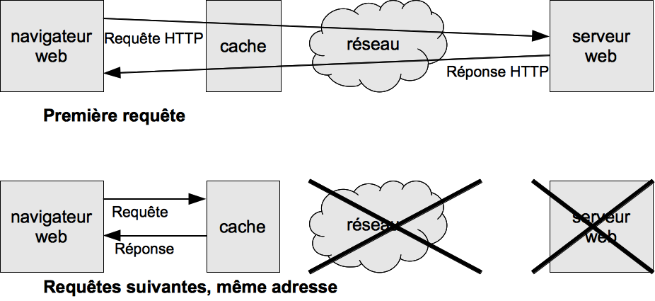
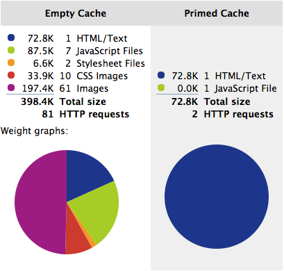
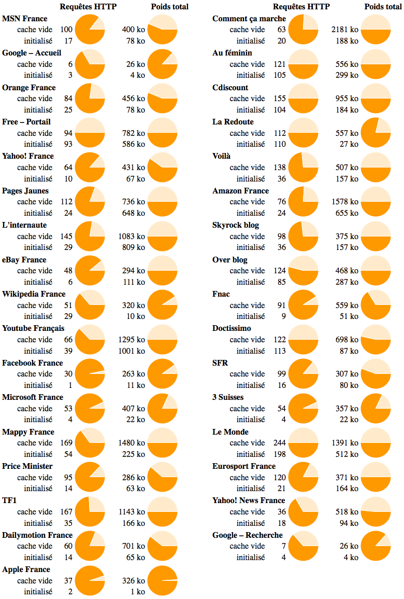
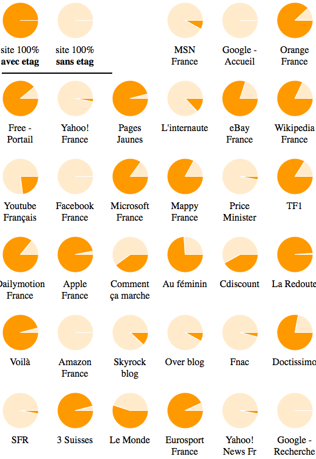
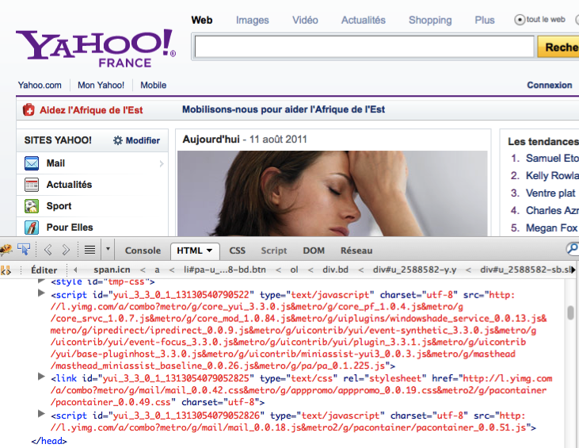
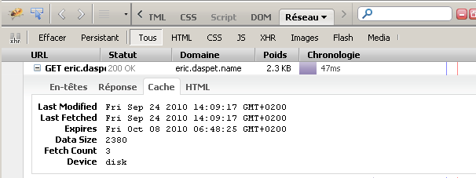
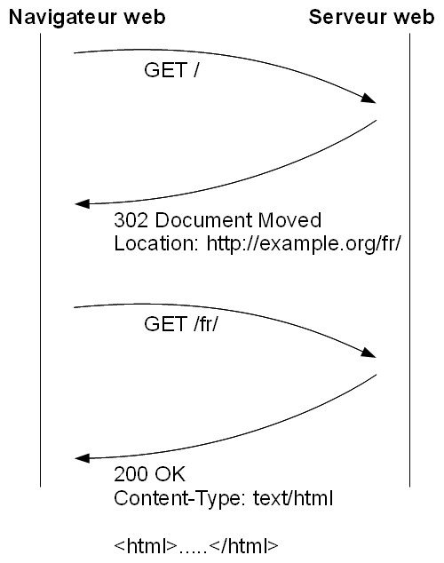

Travailler avec les caches HTTP
===============================

Ce premier chapitre technique aborde les caches HTTP. Notre objectif va
être de réduire, presque à zéro, le temps de chargement des composants
d'une page web. En fait nous allons faire en sorte que le navigateur
n'ait presque rien à télécharger sur le réseau. Comme chacun peut
l'imaginer le gain pour le navigateur, et donc pour le visiteur, est
impressionnant.

Le principe du cache
--------------------

Dans une session de navigation classique, le visiteur repasse souvent
sur la même page, ou du moins sur des pages similaires d'un même site.
Il demande plusieurs fois l'affichage d'une même ressource, d'une même
icône, d'une même feuille de style.

Sur une page web, le trafic réseau représente l'essentiel du temps
d'attente et de chargement. Couper les temps d'attente réseaux et vous
aurez une réactivité quasi instantanée. 

Pour cela le navigateur stocke certaines ressources dans un cache local
au premier accès. Il stocke en fait simplement les fichiers
correspondants sur disque ou en mémoire. Quand il a besoin une nouvelle
fois de cette même ressource, il peut la prendre dans cet espace
temporaire rapide, sans avoir à la re-télécharger et à subir les délais
dus au réseau.

Importance du cache
-------------------

Sur deux pages d'un même site, on peut facilement avoir 80 % des
composants identiques. Si le cache est correctement utilisé, la seconde
page ne télécharge donc que les 20 % qui lui manquent. C'est ça qui peut
faire la différence entre un site lent et un site instantané.

Pour un utilisateur, passer de 81 requêtes HTTP à 2, ou de 400 ko à
75 ko c'est la différence entre une voiture et un vélo en performances.
Le résultat est visible immédiatement.

Mais en plus du gain visible pour l'utilisateur, vous avez un bonus.
Vérifiez combien vous coûtent vos serveurs et votre bande passante.
Imaginez diviser par 40 le nombre de hits ou par 5 votre bande passante.
L'investissement est très vite rentable. 

Sur l'échantillon de sites français testés on identifie le nombre de
requêtes et le poids total du document. Pour chaque site le premier
camembert montre la proportion de requêtes HTTP économisées si le cache
est initialisé (en foncé) par rapport au total des requêtes HTTP
réalisées. Le second camembert montre ce même rapport en prenant en
compte le volume de données téléchargé plutôt que le nombre de requêtes
HTTP. Un graphique essentiellement foncé montre que le cache permet
d'éviter l'essentiel des requêtes et des téléchargements. Un graphique
majoritairement clair montre à l'inverse que le cache est inefficace ou
mal exploité.

Un mauvais résultat (graphique clair) n'est toutefois pas toujours
facile à interpréter. Ce peut aussi être un type de page qui profite peu
du cache mais c'est aussi le plus souvent simplement que l'équipe de
développement n'a pas exploité le cache du navigateur et laissé de
mauvaises performances là où on aurait pu avoir de très bons résultats.
On ne peut donc pas les ériger en contre-exemples. C'est en fait plus le
symptôme d'une mauvaise qualité des sites français.

À l'inverse, les bons résultats (graphique foncé) sont une preuve de
l'effet qui peut être obtenu en travaillant les performances du site
web. Wikipedia, Facebook, Microsoft, Apple, Dailymotion, la Fnac,
permettent d'économiser plus de 90 % de la bande passante lors du second
accès. Ils représentent des sites de contenu, des sites vitrine, des
sites de commerce, des sites orientés vidéo. Très peu de catégories sont
exclues et même la page d'accueil de Google qui n'a pour ainsi dire
aucun composant complexe arrive à diviser par 6 se bande passante.

Cache initialisé et cache vide, utilisateurs concernés
------------------------------------------------------

On parlera de cache vide ou de premier accès quand le cache du
navigateur ne contient pas encore les éléments que vous souhaitez y
entreposer. Il est alors obligé de télécharger tous les composants
nécessaires. À l'inverse on parlera de cache initialisé ou de second
accès quand le navigateur a déjà tous les composants dans son cache et
peut les réutiliser sans avoir à les re-télécharger.

### Nombre d'utilisateurs concernés

Sur le papier un utilisateur arrive la première fois avec un cache vide.
Les composants de la page sont mis en cache par le navigateurs puis
toutes les pages suivantes, dans la même session ou dans toutes ses
sessions futures, sont téléchargées avec un cache pré-initialisé. 

En pratique les choses sont un peu différentes. Le cache des navigateurs
est limité en taille et vos utilisateurs ne naviguent pas que sur votre
site. Au fur et à mesure de leur surf le cache se rempli, et certains
anciens éléments sont effacés pour laisser de la place, peut être les
vôtres. Le résultat c'est qu'à la prochaine visite sur votre site, on se
retrouve dans la situation d'un cache vide : le navigateur doit
retélécharger tous vos composants.

Ensuite certaines politiques de sécurité d'entreprise ou de gestion de
la vie privée vident automatiquement et régulièrement le cache de
certains utilisateurs. Ces utilisateurs vont devoir réinitialiser
souvent leur cache et se retrouveront régulièrement dans une situation
qui correspond à nos mesures « cache vide ».

Enfin, sur un site web public, une part non négligeable des utilisateurs
viennent des moteurs de recherche. Ce sont des visiteurs qui viennent
pour la première fois sur votre site et qui, pour la plupart, ne
visiteront que peu de pages. Eux se retrouvent très souvent dans une
situation de cache vide.

### L'étude Yahoo!

L'équipe performance de Yahoo! a mené une étude [^16] pour connaître la
proportion de caches vides et de caches pré-initialisés lors de l'accès
à leur page d'accueil. Les résultats publiés montrent que 40 à 60 % des
visiteurs ont subi à un moment où un autre une expérience de cache vide
mais surtout 20 % des pages sont chargées avec un cache vide. 20 % c'est
une page sur cinq. Un nombre important des utilisateurs ne profitent
donc pas du cache : les optimisations du cache sont essentielles, mais
ne perdez pas de vue qu'une partie des utilisateurs n'en profiteront
pas.

La page d'accueil de Yahoo! est très spécifique et ces chiffres ne sont
probablement pas généralisables à tous les sites. Toutefois, la tendance
est, elle, certainement généralisable sur la plupart des sites web
publics : Les accès à votre site avec un cache vide sont fréquents et
non négligeables. Si vous avez un doute, faites vos propres mesures. La
réalisation est assez simple et Yahoo! explique comment faire dans son
étude.

[Proportion d'utilisateurs ou pages vues avec un cache vide](img/chap03-proportion-d-utilisateurs-ou-pages-vues-avec-un-cache-vide)[^17]

  [^16]: [Performance Research, Part 2: Browser Cache Usage – Exposed!, Yahoo!, janvier 2007](http://yuiblog.com/blog/2007/01/04/performance-research-part-2/)
  [^17]: © 2007- 2009  Reprinted with permission from Yahoo! Inc. YAHOO! and the YAHOO! logo are trademarks of Yahoo! Inc.

### Utilisateurs mobiles

Les terminaux mobiles ont des navigateurs de qualité très variable,
globalement plutôt mauvais. Android WebKit, Safari (iPhone) et Opera
Mobile sont à peu près au niveau mais les autres navigateurs sont
parfois catastrophiques, même quand ils sont eux aussi basés sur le même
code source.

Cloud Four a mené un test à grande échelle. Les résultats sont assez
mauvais. Près d'un tiers des utilisateurs testés ont un terminal qui ne
met pas en cache les ressources web. Les résultats sont très disparates
suivant les versions d'un même navigateur, ainsi une installation de la
version 3 d'Opera Mini fonctionne correctement. alors qu'une
installation de la version 4 ne gère aucun cache. Parmi les terminaux
les plus répandus, les Blackberry et Opera Mini 4 ont un sérieux
problème de cache. IE Mobile 7.x et Opera Mobile 8.x ont quelques
installations qui elles aussi ne permettent pas le cache (respectivement
sur 30% et 10% des tests).

Le résultat c'est que vous ne pouvez pas vous reposer sur le cache comme
palliatif des connexions bas débit des terminaux mobiles. Il sera
important de réduire au maximum la taille des composants, en tenant
compte du faible débit mais aussi de la probable absence de cache.

**Recommandation :** Prévoyez qu'une grande partie de vos utilisateurs
mobiles ne pourront pas profiter du cache. Limitez le nombre de vos
composants ainsi que leur taille.

### Résultats globaux

Toutefois, gardez en tête les résultats de Apple ou de Microsoft. Même
si 20 % des utilisateurs n'en profitent pas, le gain reste intéressant
en moyenne : gagner 90 % de la bande passante sur 80 % des pages, ça
permet encore de diviser la bande passante globale par 3 à 4.

Requête conditionnelle
----------------------

La principale problématique du navigateur c'est de savoir quoi mettre en
cache et combien de temps. Un élément qui ne part pas en cache, c'est un
téléchargement en plus. Un élément qui reste trop longtemps en cache,
c'est un élément qui risque de ne pas être mis à jour dans le rendu du
navigateur quand bien même il aurait changé sur le serveur.

Le premier mécanisme mis en oeuvre pour répondre à ces questions est la
requête conditionnelle. Il s'agit pour le serveur d'informer le
navigateur sur la date de dernière mise à jour du contenu. Dans les
téléchargements suivants, le navigateur peut demander au serveur si la
ressource a changé. Si ce n'est pas le cas, alors on évite de la
retélécharger.

### Détails HTTP

Lors du premier téléchargement, le serveur web envoie un identifiant ou
une date de mise à jour du contenu. L'entête en jeu pour la date de mise
à jour s'appelle `Last-Modified`. Elle utilise le format de la RFC 1123 :
`Sun, 06 Nov 1994 08:49:37 GMT`.

Requête :

~~~~~~~ {.http .request}
GET /index.html HTTP/1.1
Host: example.org
~~~~~~~

Réponse :

~~~~~ {.http .response}
HTTP/1.1 200 OK
Date: Sun, 02 Nov 2008 15:54:27 GMT
Last-Modified: Tue, 15 Nov 2005 13:24:10 GMT
Etag: "280100-1b6-80bfd280"
Content-Type: text/html; charset=UTF-8

<HTML>
[…]
</HTML>
~~~~~

Lors des téléchargements suivants, le navigateur renvoie cet identifiant
ou cette date et demande un téléchargement conditionnel. Cela se fait
avec l'entête `If-Modified-Since`, en reprenant la date fournie la
dernière fois par le serveur. Si le contenu a changé, tout ce passe
comme habituellement, et le serveur renvoie une nouvelle date.

Seconde requête :

~~~~~~~ {.http .request}
GET /index.html HTTP/1.1
Host: example.org
If-Modified-Since: Tue, 15 Nov 2005 13:24:10 GMT
Accept-Encoding: gzip,deflate
~~~~~~~

Réponse :

~~~~~ {.http .response}
HTTP/1.1 200 OK
Date: Sun, 02 Nov 2008 15:54:27 GMT
Last-Modified: Sun, 01 Feb 2009 18:44:18 GMT
Etag: "29244f-45d-3819bb2e"
Content-Type: text/html; charset=UTF-8

<HTML>
[…]
</HTML>
~~~~~

Si au contraire le contenu n'a pas été mis à jour depuis la dernière
fois, le serveur web se contente de signaler que rien n'a changé. Pour
cela il renvoie un code de retour 304 au lieu de l'habituel code 200 et
du contenu. Il y a toujours une requête HTTP, et donc un léger délai,
mais on évite de re-télécharger le contenu lui-même. Si la ressource
dépasse un ou deux kilo-octets, cela fait une différence.

Seconde requête :

~~~~~~~ {.http .request}
GET /index.html HTTP/1.1
Host: example.org
If-Modified-Since: Tue, 15 Nov 2005 13:24:10 GMT
~~~~~~~

Réponse (seules des entêtes sont envoyées, aucun contenu) :

~~~~~ {.http .response}
HTTP/1.1 304 NOT MODIFIED
Date: Sun, 02 Nov 2008 15:54:27 GMT
Content-Type: text/html; charset=UTF-8
~~~~~

### Support des navigateurs

Tous les navigateurs savent gérer les requêtes conditionnelles. Les
seules exceptions sont certains mauvais robots de téléchargement de fils
RSS. La situation évolue toutefois sur ces derniers logiciels et on peut
considérer que les mauvais clients HTTP se font rares.

Le protocole HTTP laisse toutefois une marge d'appréciation au
navigateur. Ainsi, certains navigateurs vérifient s'il y a mis à jour à
chaque visite, ou à chaque session, ou encore à chaque page. C'est cela
qui fait que parfois sur Microsoft Internet Explorer on continue pendant
quelques temps à voir un ancien contenu au lieu de voir la mise à jour.

Pour palier ce problème, il est possible de demander explicitement au
navigateur de revalider son contenu à chaque fois. Cela se fait avec le
paramètre `must-revalidate` de l'entête `Cache-Control` envoyée par le
serveur :

~~~~~ {.http .partial .response .oneline}
Cache-Control: public; must-revalidate
~~~~~

Il existe aussi un paramètre `proxy-revalidate`, qui a le même effet mais
qui s'adresse uniquement aux serveurs proxy. Les autres paramètres de
cette entête sont détaillées plus loin dans ce chapitre.

### Mise en œuvre sur le serveur web

La configuration par défaut de votre serveur web s'occupe de gérer tout
cela avec les contenus statiques. Si vous utilisez du contenu dynamique
(PHP, Java, Ruby, Python, etc.) c'est à vous de déterminer la dernière
date de modification de vos contenus, de comparer avec celle que vous
recevez, et d'envoyer soit le code de retour 304 soit l'entête
Last-Modified.

**Recommandation :** Gérez manuellement les entêtes HTTP de cache quand
vous servez du contenu dynamiquement (PHP, .Net, Ruby, Python, etc.) et
principalement des contenus réutilisables changeant peu (CSS,
Javascript, images).

Avec Ruby On Rails, un mécanisme est prévu pour cela dans le framework
via la méthode `fresh_when`, qui prend une date de dernière modification
et un etag :

~~~~~~~ {.ruby .rails}
fresh_when :last_modified => @article.published_at.utc, 
           :etag => @article
~~~~~~~

En PHP vous pouvez utiliser une fonction comme la suivante :

~~~~~~~ {.php}
<?php
function HttpCache($last_modified_timestamp)  {
  if( isset($_SERVER['HTTP_IF_MODIFIED_SINCE']) ) {
    $from_browser = $_SERVER['HTTP_IF_MODIFIED_SINCE'] ;
    $from_browser = strtotime($from_browser) ;
    if ($from_browser = = $last_modified_timestamp) {
      header('Not Modified', true, 304) ;
      exit ;
    }
  }
  $format = 'D, d M Y H:i:s' ;
  $to_browser = gmdate($format, $last_modified_timestamp) . ' GMT' ;
  header("Last-Modified: $to_browser");
}
~~~~~~~

ETag
----

La gestion du cache par dernière date de mise à jour est le mécanisme
dynamique proposé par la version 1.0 du protocole HTTP. Le protocole
HTTP 1.1 propose un mécanisme plus étendu : l'etag (pour entity tag, en
anglais).

### Détails HTTP

Au lieu d'une date avec `Last-Modified`, on envoie un identifiant textuel
avec l'entête `ETag`. Cet identifiant est ensuite renvoyé avec
`If-None-Match` au lieu de `If-Modified-Since`.

Première réponse :

~~~~~~~ {.http .response}
HTTP/1.1 200 OK
Date: Sun, 02 Nov 2008 15:54:27 GMT
Server: Apache/2.2.3 (CentOS)
Last-Modified: Sun, 01 Feb 2009 18:44:18 GMT
Etag: "29244f-45d-3819bb2e"
Content-Type: text/html; charset=UTF-8

<HTML>
[…]
</HTML>
~~~~~~~

Requête suivante :

~~~~~~~ {.http .request}
GET /index.html HTTP/1.1
Host: example.org
If-Modified-Since: Tue, 15 Nov 2005 13:24:10 GMT
If-None-Match: "29244f-45d-3819bb2e"
~~~~~~~

### Avantages des Etags sur les dates de dernière modification

Il y a deux avantages à ce nouveau procédé. Tout d'abord on peut gérer
des mises à jour plus fines, éventuellement plusieurs mises à jour pour
une même seconde, ce qui n'était pas possible auparavant. Ensuite HTTP
1.1 permet de gérer plusieurs représentations d'un même document à la
même adresse, par exemple un même contenu en plusieurs langues. Il est
ainsi possible d'avoir plusieurs identifiants pour une même adresse (un
par représentation), ce qui n'était pas réalisable avec les dates de
modification.

En réalité tous les clients HTTP ne savent pas gérer cette négociation
avec etag. Il faut donc toujours la doubler avec la négociation par date
de dernière modification quand on le peut.

Au final, comme peu de sites utilisent plusieurs représentations pour
une même adresse, et comme on doit de toutes façons doubler avec la date
de dernière modification, la gestion des etag a un intérêt limité.

### Désactiver les etags ?

L'équipe performance de Yahoo! a proposé dès le départ de désactiver la
gestion des etags sur les serveurs web. Outre leur intérêt limité, ils
posent en effet quelques problèmes.

L'etag est un identifiant unique textuel. Pour trouver cet identifiant
unique, le serveur web le plus courant sur le marché utilise
l'identifiant interne du fichier sur le disque (l'inode) associé à la
date de modification du fichier. Si vous avez un gros site avec
plusieurs serveurs, chacun a son disque, et l'identifiant interne du
fichier sera différent sur chaque serveur. 

Chaque serveur aura donc son propre identifiant, différent de celui des
autres. Pour peu que la première et la seconde requête ne touchent pas
le même serveur, vous re-téléchargerez inutilement des contenus. Bref,
non seulement inutiles, les etags vont pénaliser vos performances.

Désactiver les etags sous Apache peut être réalisé avec la directive :

~~~~~~~ {.apache .oneline}
FileETag none
~~~~~~~

En réalité il existe d'autres méthodes de génération des etags, qui ne
comportent pas ce défaut. Il suffit de ne pas utiliser l'identifiant
interne du fichier (l'inode). On peut par exemple recommander d'utiliser
la date de dernière modification associée à la taille du fichier :

~~~~~~~ {.apache .oneline}
FileETag MTime Size
~~~~~~~

**Recommandation :** Si votre site utilise plusieurs serveurs web,
désactivez les etags ou assurez-vous qu'ils ne se basent pas sur l'inode
des fichiers.

Désactiver les etags est plus simple, et vu leur faible utilité c'est
probablement le plus simple, mais le choix vous revient. Si votre site
n'utilise qu'un seul serveur pour l'instant, ne vous en préoccupez pas.

### Statistiques

L'analyse d'un échantillon d'une trentaine de sites français ne dégage
pas de consensus fort sur la questions des etag. À peu près autant
fonctionnent avec etag que sans etag. Tout au plus peut-on noter que
ceux qui ont les meilleures performances, donc qui ont probablement le
plus réfléchi à la question, ont plutôt tendance à la désactivation.

Il n'y a pas non plus de spécificité suivant le type de contenu (html,
javascript, feuille de style, images, autres). Seul Cdiscount fait une
différence en mettant des etag sur 60 images mais aucun des 25 fichiers
javascript ou des 19 fichiers CSS.

Note : Sur la plupart des sites on peut voir qu'il y a toujours quelques
contenus sans etags, et quelques contenus avec etag. Il s'agit le plus
souvent de publicités et contenus externes, non contrôlés par le site
lui-même, ou de contenu très dynamique regénéré à chaque accès (dans le
cas de l'absence des etags). 

Expiration explicite des contenus
---------------------------------

Le système des requêtes conditionnelles reste imparfait du point de vue
des performances, qu'il soit basé sur la date de dernière modification
ou l'etag. Chaque nouvelle utilisation d'une ressource implique une
requête conditionnelle sur le serveur. 

On évite de transférer le contenu de la ressource mais on attend quand
même une réponse réseau. Pour une page classique avec cinquante
composants, deux téléchargements simultanés, et une latence de 40 ms,
nous devrons attendre au mieux une bonne seconde pour rien.

~~~~~~~ {.oneline}
attente minimum = nbr ressources / connex. simultanées \* latence
~~~~~~~

La solution c'est l'expiration explicite des contenus. Il s'agit
d'informer le navigateur que la ressource ne changera pas avant une
certaine date. Jusque là, le navigateur récupère directement son
ancienne version sans faire aucune requête réseau.

### Détails HTTP

Lors de la première réponse, le serveur envoie une entête HTTP nommée
`Expires` ou la propriété `max-age` de l'entête `Cache-Control`. La première
permet de définir une date d'expiration au format HTTP. La seconde est
réservée à HTTP 1.1 et permet de définir plutôt une période de validité
avec un nombre de secondes. On évite ainsi les problèmes synchronisation
horaire. 

En général on définit les deux. En cas de conflit c'est `Cache-Control`
qui prime. `Expires` ne servira que pour un client HTTP 1.0 qui ne
comprend pas `Cache-Control`. Si vous n'en choisissez qu'une, utilisez
`Expires`.

Réponse HTTP :

~~~~~~~ {.http .response}
HTTP/1.1 200 OK
Date: Sun, 02 Nov 2008 15:54:27 GMT
Server: Apache/2.2.3 (CentOS)
Last-Modified: Sun, 01 Feb 2009 18:44:18 GMT
Expires: Sun, 01, Feb, 20010 18:44:18 GMT
Cache-Control: max-age=31536000

[…]
~~~~~~~

Jusqu'à l'expiration des contenus – ou si le visiteur renouvelle le
cache de son navigateur – le navigateur ne fera plus aucune requête pour
ces ressources. Cela implique aussi que si vous modifiez l'image ou le
fichier concerné, les visiteurs qui l'ont déjà en cache ne verront pas
la mise à jour. Aucun procédé ne vous permettra de forcer vos visiteurs
à mettre à jour leur cache. Cette problématique est abordée plus loin
dans cette section, avec deux solutions qui sont utilisées par
l'essentiel des sites web.

Si le cache d'une ressource a expiré, le navigateur utilisera une
requête conditionnelle plus classique pour revalider son contenu (et
éventuellement ne pas avoir à le retélécharger). Il obtiendra alors une
nouvelle date d'expiration explicite, et éventuellement le nouveau
contenu si la ressource a été mise à jour entre temps.

Si la directive `max-age` est présente en même temps que `must-revalidate`,
alors le client peut utiliser le cache pendant le temps indiqué, mais il
doit ensuite absolument revalider son contenu et ne pas réutiliser le
cache plus longtemps. Cela s'adresse particulièrement à certains proxy
intermédiaires qui sont configurés pour imposer leurs propres durées
d'expiration sans prendre en compte ce qui est demandé par le serveur. 

Note : Pour `Cache-Control`, il existe aussi une directive `s-maxage`,
identique à la précédente, mais qui s'adresse uniquement aux serveurs
proxy.

### Que mettre en cache et pour combien de temps**

En pratique on sépare d'un côté les ressources qui ne changent que
rarement, voire jamais (images de graphisme, feuilles de style,
javascript, et plus généralement tous les fichiers statiques), et d'un
autre côté les ressources dynamiques ou qui changent fréquemment
(principalement le code HTML et quelques échanges ajax).

Les ressources statiques peuvent le plus souvent être mises en cache à
vie, c'est à dire une dizaine d'années. Les ressources dynamiques
dépendent de votre application :

Le plus souvent les pages HTML contiennent des sections ou des
informations liées à une authentification, des commentaires, des
actualités, des publicités ou d'autres éléments qui nécessitent d'être
réactualisés par le serveur à chaque accès. Ainsi sur l'essentiel des
sites, les pages HTML elles-même ne sont pas mises en cache. 

**Recommandation** : Pour tous les fichiers statiques (qui ne devraient
pas être mis à jour plus d'une à deux fois par semaine dans les périodes
de plus grand changements), définissez une expiration explicite très
importante, par exemple dix ans.

Attention particulièrement au fichier favicon.ico qu'on oublie
fréquemment. Ce fichier est d'autant plus spécial qu'il est préférable
de ne pas en changer l'adresse. Une préconisation spécifique est prévue
plus loin dans ce chapitre concernant sa date d'expiration.

### Mise en œuvre sur le serveur web

Par défaut votre serveur web ne définit aucune expiration explicite.
C'est à vous de spécifier ce que vous souhaitez dans votre
configuration. Pour Apache il est possible d'utiliser 
[mod_expires](http://httpd.apache.org/docs/2.2/mod/mod_expires.html).
Vous pourrez, pour un répertoire précis ou pour certains types de
ressources précis, définir une date d'expiration ou une durée de
validité pour vos contenus.

Ces expirations peuvent être définis par rapport à la date d'accès (cas
préférable) ou à la date de dernière modification (pour des cas très
spécifiques) :

~~~~~~~ {.apache}
ExpiresActive On\
ExpiresDefault "access plus 1 month"
ExpiresByType text/html "access plus 1 month 15 days 2 hours"
ExpiresByType image/gif "modification plus 5 hours 3 minutes"
~~~~~~~

Pour les fichiers générés par Java, PHP ou Rails, il vous faudra définir
vous-même les entêtes HTTP. Par exemple pour PHP :

~~~~~~~ {.php}
<?php
$expires = 3600 * 24 * 365 * 10 ; // 10 ans
$format = 'D, d M Y H:i:s' ;
$to_browser = gmdate($format, time()+$expires) . ' GMT' ;
header("Expires: $to_browser"); 
header("Cache-Control: max-age=$expires") ;
~~~~~~~

Pour des fichiers HTML avec une expiration courte, comme une page
d'accueil, n'oubliez pas de gérer aussi les requêtes conditionnelles,
afin de permettre au navigateur de revalider son contenu et obtenir une
nouvelle expiration sans tout retélécharger.

Sur Lighttpd les paramètres du modExpire sont similaires mais la syntaxe
du fichier de configuration laisse plus de latitude pour cibler les
contenus à mettre en cache :

~~~~~~~ {.lighttpd}
$HTTP["url"] =~ "^/images/" {
  expire.url = ( "" => "access plus 1 hours" )
}
~~~~~~~

### Cas particulier des connexions sécurisées (https)

Microsoft Internet Explorer a un comportement particulier quand les
ressources en cache viennent de connexions sécurisées par https. Le
navigateur impose d'avoir au moins établit un échange avec le serveur
dans la page courante avant de réutiliser des données de ce serveur dans
le cache. En pratique cela veut dire que le premier composant de chaque
domaine accédé en https sera toujours retéléchargé et jamais pris à
partir du cache, quelles que soient les entêtes que vous lui envoyez. Il
en va de même pour Mozilla Firefox.

En fait on va même un peu plus loin puisque si vous demandez trois
images sur un domaine https, même si ces dernières sont en cache, ce sont
peut être les trois qui seront retéléchargées. Internet Explorer
télécharge la première, à dessein, mais risque de ne pas avoir encore la
réponse avant de tenter d'afficher la seconde image. Au lieu d'attendre,
il constate qu'il n'a toujours pas établit de connexion, et envoie une
seconde requête à la couche logicielle qui s'occupe du réseau. 

### Versionnement des URLs et mise à jour des contenus

Avec une date d'expiration explicite, il n'y a aucun moyen pour
l'éditeur d'un site web de forcer une mise à jour d'un contenu mis en
cache par le navigateur. Si vous changez un logo ou faites des
corrections dans une feuille de style, certains visiteurs risquent de ne
jamais recevoir la nouvelle version

Pour palier ce problème, il est possible de versionner les URL. Le cache
du navigateur est en effet lié à l'adresse de la ressource. Si on change
cette adresse, le navigateur considère qu'il s'agit d'une nouvelle
ressource. Il suffit alors de changer l'adresse des composants à chaque
modification.

#### Forme des adresses versionnées

Il suffit d'ajouter un jeton à l'adresse normale du fichier, et de
s'assurer que ce jeton sera différent à chaque modification. On peut
l'ajouter soit dans un paramètre à la fin de l'adresse
(monstyle.css?xxx), soit dans le nom du fichier lui même
(monstyle-xxx.css). La première forme a l'avantage de ne nécessiter
aucun changement dans le stockage ou la configuration du serveur web. La
seconde forme impose d'avoir un fichier physique par version, ou
d'utiliser une réécriture d'URL comme celle qui suit (exemple avec
mod_rewrite et Apache) mais permet de garder un historique des
versions :

~~~~~~~ {.apache .online}
RewriteRule ^(.*)-\d\.\d(\.[a-z]{1,5})$  $1$2
~~~~~~~

La seconde forme, avec un jeton directement intégré dans le nom du
fichier est très fortement préférable. En effet, HTTP propose par défaut
de désactiver les caches non explicites s'il y a des paramètres
(présence d'un point d'interrogation) dans l'adresse. Vous risqueriez de
ne pas utiliser au mieux certains caches mal configurés même si vous
avez une expiration explicite. 

#### Forme et génération du jeton unique

Le jeton a pour seule contrainte d'être unique. Quand il est géré
manuellement ou via un processus de publication hors ligne, on utilise
généralement un simple numéro de version (monstyle-1.3.css). C'est ce
qu'utilisent la plupart des sites à fort trafic qui ont industrialisé
ces questions.

Il est aussi possible d'automatiser cette gestion en utilisant la date
de dernière modification du composant comme jeton. C'est ce que fait le
framework Ruby on Rails par défaut pour les fichiers statiques. En PHP
on pourrait utiliser la fonction suivante pour faire des liens :

~~~~~~~ {.php}
<?php
function lien_avec_version($fichier) {
  $prefixe = "/var/www/htdocs" ; // suivant votre configuration
  $date = filemtime($prefixe.$fichier) ;
  return "$fichier?$date" ;
}
$url = lien_avec_version("/monimage.png") ;
echo "  ";
~~~~~~~

Si vous utilisez cette dernière méthode, préférez générer les jetons une
fois pour toute à la publication des pages. Si vous utilisez un code PHP
exécutable à chaque requête (comme dans l'exemple ci-avant) vous risquez
de surcharger inutilement vos serveurs.

#### Cas particuliers et favicon.ico

Certains fichiers ont une adresse web qui ne peut pas changer ou qu'il
serait préférable de ne pas changer. C'est par exemple le cas du
favicon, que certains navigateurs chercheront par défaut à l'adresse
`/favicon.ico`. Dans ce cas il n'est pas souhaitable de changer le nom du
fichier et donc pas possible de lui rajouter des paramètres pour
invalider le cache. Il faut donc éviter des expirations explicites trop
longues et proposer plutôt une expiration de quelques jours (une à deux
semaines par exemple).

**Recommandation** : Définissez une expiration explicite de 2 à 15 jours
pour le favicon.ico afin d'en faciliter le cache sans empêcher d'en
changer le contenu à l'avenir.

Différencier les copies suivant les utilisateurs et les contextes
-----------------------------------------------------------------

Le bénéfice du cache HTTP est indéniable mais il pose d'autres
problèmes : Si plusieurs personnes passent pas le même proxy, elles ne
pourront pas accéder à des données personnalisées. De même, les méthodes
vues jusqu'à présent empêchent la donnée de varier en fonction du
contexte (personne identifiée ou non, présence d'un panier, langue du
navigateur, etc.).

Pour nous aider nous avons l'entête `Vary` et deux paramètres
supplémentaires à l'entête `Cache-Control`.

L'entête `Vary` permet d'informer le navigateur et les caches
intermédiaires du contexte de réutilisation de la page. En ajoutant
`Cookie` comme valeur, une donnée en cache ne sera réutilisée que pour les
futures requêtes avec la même valeur de cookie. En ajoutant
`Accept-Language` on pourra avoir un cache différent par langue des
navigateurs. On peut aussi trouver `Accept-Encoding` (qui permet de savoir
si le navigateur accepte ou pas la compression HTTP), `User-Agent` (pour
faire une page différente suivant les navigateurs) ou `Accept` (pour faire
un contenu qui peut être envoyé en plusieurs formats suivant ce que
supporte le navigateur). Ces différentes valeurs peuvent être cumulées
en les séparant par des virgules.

L'entête suivante permet de servir un cache différent suivant la langue
et le navigateur :

~~~~~~~ {.http .response .partial .online}
Vary: Accept-Language, User-Agent
~~~~~~~

Il est souvent plus simple de se passer totalement des caches partagés
(proxy) et de se contenter du cache des navigateurs. On s'assure alors
que chaque client a sa propre page et ses propres contenus, sans pour
autant s'empêcher de profiter du cache. Pour cela il suffit de rajouter
le paramètre `private` à l'entête `Cache-Control`. 

~~~~~~~ {.http .response .partial .online}
Cache-Control: private, max-age=3600 
~~~~~~~

Le paramètre opposé, `public`, explicite que la donnée est publique,
partageable à tous et donc utilisable par un cache partagé. C'est public
qui est la valeur par défaut pour les requêtes de type GET. Pour les
requêtes de type POST ou en erreur 404 cela autorise le navigateur à
mettre le résultat en cache (ce qu'il n'aurait pas fait sinon) et donc à
ne pas retransmettre la donnée au serveur la prochaine fois. On se
contente habituellement de spécifier ce paramètre pour les requêtes de
type GET sans erreur, sinon le serveur risque de ne pas déclencher
certains traitements en provenance de formulaire (vu que le navigateur a
utilisé le cache).

~~~~~~~ {.http .response .partial .online}
Cache-Control: public, max-age=3600 
~~~~~~~

De manière générale on choisit entre public et privé suivant que la
ressource contient des données propres à l'utilisateur courant ou si
elle peut être réutilisée par tout le monde. Dès que vous avez une
authentification ou des préférences utilisateurs, c'est probablement un
`Cache-Control:private` qu'il vous faut.

Cache applicatif HTML 5
-----------------------

La spécification HTML 5 a prévu des fonctionnalités avancées de cache
pour les applications hors-ligne. Il s'agit de pouvoir utiliser un site
web une fois déconnecté, par exemple pour lire du contenu pré-téléchargé
ou pour gérer des données comme des e-mails. Les images, illustrations,
et composants, doivent alors être sauvegardés par l'appareil pour être
réutilisés sans être retéléchargés.

Un fichier texte nommé manifeste liste les différentes ressources qui
seront sauvegardées en cache suivant la syntaxe suivante : une première
ligne avec « CACHE MANIFEST », une adresse de ressource (relative ou
absolue) par ligne. 

~~~~~~~ {.cachemanifest}
CACHE MANIFEST
 /style.css
 /yui.js
 /img/icones.png
 /img/bandeau.jpg
~~~~~~~

Il suffit ensuite de servir ce fichier avec le type mime
`text/cache-manifest` et d'en référencer l'adresse dans l'attribut
manifest de la balise `<html>` du document principal :

~~~~~~~ {.html}
<!DOCTYPE HTML>
<html manifest="/cache.manifest">
<head> ... </head>
<body>
...
</body>
</html>
~~~~~~~

À chaque accès le navigateur télécharge le manifeste. S'il s'agit d'un
nouveau manifeste ou si le contenu a changé toutes les ressources sont
retéléchargées pour être mises à jour. Le cache applicatif HTML 5 permet
en fait d'autres possibilités (liste blanche, fallback, API pour accéder
aux différents événement dans le navigateur, etc.) mais cela dépasse le
cadre de ce livre.

Il s'agit d'une alternative intéressante au cache HTTP avec expiration
explicite. Elle ajoute en effet une fonctionnalité nouvelle : l'auteur a
l'initiative de déclencher la mise à jour des ressources en cache. La
syntaxe est toutefois plus complexe, un fonctionnement moins souple et
son support est limité (seules les dernières versions des navigateurs
supportent cette nouveauté).

Exploiter au mieux les caches
-----------------------------

### Externaliser les ressources

De manière générale, il est préférable de ne pas mettre en cache les
pages web elle même, uniquement leurs composants statiques. Elles
contiennent presque toutes une invite d’authentification utilisateur,
des publicités, des commentaires utilisateurs ou une section
d’actualités. Ces éléments doivent être réactualisés et si la page était
mise en cache, ils resteraient bloqués à leur ancienne valeur.

Ainsi, afin de profiter au maximum du cache, on tente de séparer les
composants statiques du reste de la page. En externalisant les feuilles
de style et les javascript dans des fichiers externes, on permet que ces
codes ci soient mis en cache, selon les méthodes expliquées plus avant,
quand bien même la page HTML elle-même ne le seraient pas. 

Cette externalisation, où chaque déclaration javascript ou css est
retirée du code HTML, permet de réduire de façon importante la taille de
chaque page, et donc le temps de téléchargement pour l’utilisateur.
Chaque clic sur un lien va mener à une nouvelle page bien plus
rapidement.

En contre-partie, nous augmentons le nombre de requêtes HTTP à faire
lors du premier accès à votre site. Cela peut avoir un impact
significatif si votre site a une grande latence, ou si vos visiteurs ne
consultent qu’une à deux pages à chaque visite. Nous verrons cependant
dans les chapitres suivants qu’il est possible de regrouper les
différents fichiers javascript et css pour limiter cet effet négatif.

**Recommandation** : Externalisez toutes les instructions css ou
javascript dans un fichier séparé de la page html. Vous pourrez alors
définir une expiration explicite importante sur ces éléments.

### Système de préchargement

Le préchargement est le second moyen pour optimiser au mieux les caches.
Il s’agit de télécharger un composant par avance pour la mettre en
cache. Quand le navigateur aura réellement besoin de cette donnée, il
pourra alors la récupérer instantanément à partir du cache.

Toute la difficulté est de trouver un équilibre entre le bénéfice du
préchargement et le risque de télécharger par avance des composants qui
ne seront pas utilisés ensuite. Un préchargement inutile est en effet
pénalisant pour l’utilisateur mais pour vos serveurs aussi.

Ainsi, même si votre page d’accueil n’a pas de commentaires, pourquoi ne
pas charger les icônes et codes javascript qui sont utilisés dans les
pages internes ? Les illustrations courantes, les javascripts et
feuilles de styles sont de très bon candidats au préchargement. Les
pages html elles-même offrent un ration utilité/risque un peu moins
intéressant.

**Recommandation** : Si votre page courante est très différente des
pages suivantes probables, n’hésitez pas à précharger certains
composants afin d’accélérer la transition.

La seule contrainte forte du préchargement est de ne pas être
contre-productif, c’est à dire ne pas ralentir notre page d’accueil sous
prétexte d’accélérer les suivantes. Pour cela les ressources à
précharger sont initialisées en fin de document, après tout ce qui est
utilisé sur le moment.

Une formule assez simple pourrait être utilisée : On multiple le
pourcentage d'utilisateurs qui auront besoin de la ressource dans leurs
prochains accès par le surcoût que représente le téléchargement de cette
ressource si elle n'est pas préchargée. D'un autre côté on multiplie le
pourcentage d'utilisateurs qui n'auront pas besoin de la ressource à
court terme par le surcoût que représente le préchargement de cette
ressource. Si le premier chiffre est le plus grand alors il faut
précharger, sinon il vaut mieux s'abstenir.

En pratique la question est beaucoup plus délicate car il est quasiment
impossible de déterminer le coût pour l'utilisateur d'un préchargement
inutile. Beaucoup d'utilisateurs ne ressentiront aucun désagrément,
alors que certains qui ont d'autres téléchargements parallèles verront
un ralentissement sans savoir à quoi l'attribuer.

La méthode utilisée pour le préchargement a aussi une influence dans la
décision. Ainsi comme c'est détaillé dans la suite, l'utilisation d'une
balise `<link rel="prefetch" ...>` présente moins de risques d'effet
négatif que l'utilisation d'un code javascript.

#### Prefetch et prerender

La méthode idéale est d’utiliser la balise `<link>` avec un attribut
`rel="prefetch"`. Le navigateur reconnaît alors cette balise et tente de
précharger la ressource dès qu’il est inactif. Le risque d’effet négatif
est très réduit car le navigateur vérifie qu’aucune activité réseau
n’est en cours sur aucun onglet avant de commencer. De plus il stoppe
ces préchargements dès qu’une requête normale est initiée, afin de ne
pas la pénaliser. Si cela peut impacter la bande passante d’autres
logiciels sur le même réseau, cela ne gênera jamais en aucune façon
votre session de navigation elle-même. Cette fonctionnalité est prévue
dans HTML 5 mais n’est pour l’instant implémentée que dans les
navigateurs basés sur le moteur Gecko (dont Mozilla Firefox) et quelques
versions du navigateur Blackberry.

~~~~~~~ {.html .partial .online}
<link rel="prefetch" href="http://example.org/maressource">
~~~~~~~

Vous pouvez vérifier qu'une requête est réalisée par un navigateur
Mozilla dans le cadre des liens de préchargement grâce à la présence de
l'entête HTTP `X-Moz:prefetch`.

Le navigateur Chrome (mais uniquement lui) va même un peu plus loin en
permettant l'utilisation de l'attribut `rel="prerender"`. Contrairement à
prefetch le navigateur est incité à analyser la page préchargée pour en
télécharger les sous-composants et en commencer le rendu. L'effet est
similaire à celui d'une page téléchargée dans un onglet en tâche de
fond. Vous pouvez savoir si la page est chargée en tâche de fond ou en
avant-plan grâce à la propriété javascript
`document.webkitVisibilityState` qui retournera « visible », « hidden » ou
« prerender », suivant les cas.

~~~~~~~ {.html .partial .online}
<link rel="prerender" href="http://example.org/maressource">
~~~~~~~

#### Les méthodes manuelles

Il existe d’autres méthodes, mais toutes ont un même défaut majeur : il
n’est pas possible de faire un préchargement dépendant de l’activité
réseau du navigateur. Des préchargements trop importants peuvent
ralentir le chargement d’autres onglets ou mettre en attente des
ressources sur le même domaine. Retarder des requêtes souhaitées
maintenant par l’utilisateur afin d’accélérer une future requête
potentielle est rarement intéressant. Aussi, ces méthodes ne doivent pas
référencer plus de deux ressources par domaine (afin de ne pas trop
retarder les autres requêtes du même domaine) et uniquement si elles ont
un bon rapport utilité/risque. De plus, afin de ne commencer qu’après le
chargement complet de la page courante, elles ne devraient être
initialisées qu'après l’événement onload de la page courante.

La plus simple de ces méthodes alternatives est d’utiliser des requêtes
Ajax. Elles ont l’avantage d’être asynchrones et de ne pas avoir
d’indicateur de chargement dans l’interface utilisateur. Un sablier ou
un indicateur équivalent donnerait en effet un très mauvais ressenti de
performance à l’utilisateur, même si le résultat objectif est
intéressant.

Il est aussi possible de charger des images en javascript avec `new
Image()`, de charger une bibliothèque de code javascript avec un simple
`<script>`, d'utiliser la balise `<object>`, ou même de charger des
éléments dans une iframe cachées. Ces trois méthodes peuvent toutefois
provoquer des indicateurs d’attente dans l’interface utilisateur, voire
bloquer l’interface entièrement (pendant l’interprétation de la
bibliothèque javascript par exemple).

#### DNS

Mozilla Firefox, Safari et Google Chrome, dans leurs dernières versions,
proposent aussi de précharger les résolutions DNS. Ils scannent alors
tous les liens de la page et font les requêtes DNS utiles quand
l’activité réseau le permet. Il n’y a rien à faire, mais il est possible
de demander explicitement le préchargement d’un nom de domaine avec la
syntaxe suivante :

~~~~~~~ {.html .partial .online}
<link rel="dns-prefetch" href="//example.org">
~~~~~~~

Par défaut ce préchargement n’est pas activé pour les liens sécurisé en
HTTPS. Il est possible de les demander explicitement avec la balise méta
suivante :

~~~~~~~ {.html .partial .online}
<meta http-equiv="x-dns-prefetch-control" value="on">
~~~~~~

Inversement, la valeur off permet de désactiver les préchargements DNS
(mais pourquoi le voudriez-vous ?).

Microsoft Internet Explorer 9 tente aussi de résoudre en avance les noms
de machines dans les liens en préchargement :

~~~~~~~ {.html .partial .online}
<link rel="dns-prefetch"
href="[http://example.org/index.html](http://example.org/index.html)">
~~~~~~~

Internet Explorer 9 fait même mieux puisqu'il retient les domaines
utilisés lors des précédentes visites et tente d'en assurer la
résolution par avance, au cas où. Il le fait aussi par avance pour les
premières propositions de la barre d'adresse quand elle est déroulée.

### Mise en cache des requêtes Ajax

Les sites modernes font de plus en plus appel à des requêtes dites
« Ajax ». Il s’agit simplement de requêtes HTTP faites en javascript
pour actualiser des données précises sans avoir à recharger
l’intégralité de la page web et de ses composants.

C’est ainsi qu’est réalisée l’auto-complétion du champs de recherche sur
Google ou Yahoo! par exemple. Au fur et à mesure de la saisie le
navigateur réalise quelques requêtes HTTP pour demander au serveur une
liste de recherches probable pour compléter la saisie de l’utilisateur.

Si certaines de ces requêtes doivent être réactualisées à chaque
instant, d’autres peuvent tout à fait profiter des mécanismes de cache
expliquées précédemment. Ainsi l’auto-complétion du moteur de recherche
peut tout à fait être mise en cache pour plusieurs jours :

Si je commence par taper « conn » le navigateur va établir la liste des
recherches probables. Comme cela prend un peu de temps il est probable
que j’ai tapé une lettre de plus avant d’avoir la liste. Si j’en suis à
« connex » je peux me rendre compte qu’en anglais on dit « connection »
et pas « connexion ». Je reviens sur ma saisie.

N’est-il pas appréciable que le navigateur puisse me reproposer
instantanément la liste de termes qu’il avait téléchargé tout à l’heure
plutôt que de perdre du temps à faire une nouvelle requête ? C’est ce
qu’il se passe si la requête Ajax est mise en cache. Mieux, si je
reviens demain faire la même requête, ou une approchant, la liste sera
toujours en cache, avec une réactivité instantanée.

Les mécanismes techniques pour la mise en cache sont les mêmes que pour
n’importe quel autre composant. Les entêtes de cache peuvent être
ajoutées par le serveur web ou directement par votre langage de script
serveur.

Faites juste attention aux bibliothèques javascript qui activent par
défaut un mécanisme anti-cache (injection d’un paramètre aléatoire et
unique dans l’adresse). C’est toujours une fonctionnalité optionnelle
qu’on peut désactiver, pensez-y.

**Recommandation** : Quand cela est possible, pensez à mettre aussi en
cache les requêtes Ajax, et éventuellement à désactiver le mécanisme
anti-cache de votre bibliothèque javascript.

### Mise en cache d’une page d’accueil ou d’une page événementielle à fort trafic

Sur des sites ou des pages à très fort trafic, il peut toutefois être
intéressant de profiter du cache pour les pages html elles-même, par
exemple la page d’accueil, les pages des catégories principales ou la
page qui fait l’actualité actuellement.

En leur permettant d’être mises en cache pour quelques minutes ou
quelques heures, on évite que l’utilisateur ait à recharger une page sur
laquelle il est probable qu’il reviendra plusieurs fois. Pour un site à
fort trafic ou un événementiel (imaginez le site d’un quotidien
d’actualité lors d’une manifestation ou d’une catastrophe), le gain sera
notable et appréciable. 

Il s’agit de faire alors l’opération inverse de ce qui est préconisé
ordinairement. Au lieu d’externaliser toutes les données et ressources
statiques en laissant la page html dynamique hors du cache, nous allons
tenter d’externaliser toutes les composantes dynamiques de la page pour
pouvoir mettre le html lui-même dans le cache.

Parmi ces éléments dynamiques on compte tout ce qui doit absolument être
mis à jour à chaque nouvel accès sur la page. Assez souvent il y a une
boite d’authentification utilisateur, des publicités, éventuellement un
panier sur un site marchand, ou des informations en temps réel sur un
site sportif ou d’actualité. Au lieu d’être inclus directement dans la
page html, on va réaliser du code javascript pour charger ces éléments
dans un second temps, par exemple avec Ajax. Attention toutefois à
proposer un lien ou un moyen d'accès alternatif à ses informations sans
utiliser javascript (un lien vers la page panier et vers la page
d'authentification suffisent probablement).

Notre page principale sera donc indépendante de tout élément temps réel
ou spécifique à un utilisateur. Elle pourra être mise en cache pour une
dizaine de minutes à quelques heures, suivant le contexte. Les éventuels
flux d’actualités ou commentaires utilisateurs ne seront pas rafraichis
pendant cette dizaine de minutes mais la fluidité de votre site en sera
améliorée.

**Recommandation** : En cas de besoin, définissez une expiration
explicite courte (d’une dizaine de minutes à une heure) pour les pages à
très fort trafic comme les pages d’accueil ou les pages événementielles.
Si une mise à jour plus fréquente est nécessaire pour certains
composants, il est possible de les charger dans un second temps par
Ajax.

Il s’agit majoritairement d’un compromis. Vous acceptez de charger plus
votre serveur (puisqu’il recevra une requête HTTP supplémentaire à
chaque accès, pour la partie Ajax) mais vous vous assurez que cette
éventuelle surcharge n’impacte pas le contenu principal, qui lui sera
toujours disponible rapidement. Pour peu que la partie statique et la
partie Ajax ne soient pas servies par les mêmes machines, vous pouvez
vous permettre d’être moins réactif sur la partie Ajax afin de
privilégier le service principal (navigation, contenu principal, etc.)

Si cette option n’est pas toujours bénéfique, pour des événements précis
il peut s’agir d’un gain notable en confort. Les proxy bénéficieront eux
aussi de cette architecture puisqu’il pourront servir votre contenu
principal même si votre site est en surcharge.

### Contenu dupliqué sur plusieurs URL

Les navigateurs et les serveurs proxy utilisent un système lié à l’URL
de chaque ressource pour gérer les caches. Si une ressource change
d’URL, alors c’est une nouvelle entrée dans le cache qui est utilisée.
C’est d’ailleurs sur ce principe que nous nous reposons pour versionner
les composants comment nous l’avons vu précédemment.

Cela implique toutefois qu’une ressource ne doit être accessible que par
une seule URL, sous peine de ne pas profiter au mieux du cache. Faites
donc attention à ne pas dupliquer vos URL. En particulier une page
d’accueil doit être disponible sur « / » ou sur « /index.html », mais
pas les deux. Tous les liens doivent être uniformisés.

**Recommandation** : Utilisez une et une seule adresse par ressource.
Faites particulièrement attention à l’uniformisation des adresses pour
les pages d’accueil et pages d’index (index.html, index.php, etc.).

Support HTTP et comportements par défaut
----------------------------------------

### Comportements possibles

HTTP est un protocole très souple. Les navigateurs sont finalement
responsables de ce qu’ils veulent faire. Quoi que vous demandiez, il
peuvent techniquement ne pas en tenir compte, et leur comportement par
défaut est parfois lié à une heuristique différente suivant les éditeurs
et les versions.

Par défaut, c’est à dire sans précision dans les entêtes `Cache-Control`
ni `Expires`, le navigateur peut :

* ne rien stocker et retélécharger la ressource au prochain accès (cas
  le plus probable si vous n’envoyez ni entête `Etag` ni entête
  `Last-Modified`) ;
* stocker le contenu téléchargé et faire une revalidation avec une
  requête conditionnelle au prochain accès ;
* stocker le contenu et le servir de nouveau sans faire appel au
  serveur tout au long de la session de navigation (c’est à dire
  jusqu’à ce que l’utilisateur ferme son navigateur) ou pour une durée
  arbitraire.

Microsoft Internet Explorer 6 est connu par exemple pour employer
parfois cette troisième méthode de façon inadéquate. Il faut alors
forcer un nouveau téléchargement dans le navigateur avec la touche shift
lors de la demande de rafraichissement. Ceci peut être changé dans les
préférences Internet.

Mozilla Firefox utilise aussi cette troisième méthode dès qu'il
rencontre une entête `Last-modified. Il considère met alors en cache la
ressource pour 10 % du temps depuis la dernière modification (un
composant mis à jour il y a dix jours sera mis en cache pour une journée
pleine). Pour éviter ce comportement il faut envoyer les paramètres
`no-store` et `no-cache` dans l'entête `Cache-Control`.

Pour Mozilla Firefox on peut constater ce fonctionnement avec Firebug en
dépliant les détails d'une requête et en regardant la section « cache ».

Les serveurs proxy, souvent dans les très grosses entreprises, sont
parfois configurés pour avoir eux aussi une politique de cache très
agressive et mettre en cache les pages pour quelques dizaines de minutes
ou quelques heures tant qu’ils n’ont pas d’information contraire
explicite. Ils ont toutefois tendance à ne pas mettre en cache les
contenus avec des paramètres dans l’URL (présence d’un point
d’interrogation dans l’adresse).

### Redirections et autres codes HTTP permanents

Comme nous l’avons vu, une réponse HTTP commence toujours par un code de
retour. Il est très généralement 200 (OK), 304 (le document n’a pas
changé), ou 404 (document inexistant à cette adresse).

Certains de ces codes de retour ont une sémantique qui précise l’aspect
temporaire ou permanent de cette réponse. C’est par exemple le cas des
redirections pour lesquelles on distingue trois codes distincts : 301,
302, et 307. Le navigateur qui reçoit un de ces codes est informer de
faire une seconde requête HTTP vers le serveur web, avec une nouvelle
adresse (l'adresse de redirection).

Le code 301 marque une redirection permanente. Les navigateurs et proxy
sont encouragés à mettre en cache cette information. Les prochaines
requêtes réutiliseront ce résultat et ne feront plus d’aller-retour
inutile avec vos serveurs. C’est bénéfique pour vous comme pour vos
visiteurs.

Le code 307 est lui l’opposé, c’est la marque d’une redirection
temporaire. Les navigateurs et proxy sont explicitement informés qu’ils
doivent vérifier la présence de cette redirection à chaque nouvel accès,
quelle que soit leur configuration ou le contexte. Le code 302 est un
code à tout faire, à priori à considérer comme temporaire, donc à ne pas
mettre en cache non plus.

**Recommandation** : Quand une redirection entre deux adresses est
permanente, utilisez le code HTTP 301 et non le code 302. Cette
redirection sera alors mise en cache par les visiteurs et les proxys.

D’autres codes HTTP ont une sémantique particulière. Ainsi un client
HTTP ne devrait jamais faire deux fois la même requête s’il obtient une
erreur 400 la première fois (comprenez : le résultat doit être mis en
cache). À l’inverse, le code 303 ne devrait jamais être mis en cache et
une nouvelle demande au serveur doit être réalisée à chaque fois que
nécessaire.

### Le cas particulier des rafraichissements

Les navigateurs ont prévu que l'utilisateur puisse outrepasser le cache.
C'est ce qui est fait quand vous demandez de réactualiser la page
courante. Dans ces cas là, le navigateur fera toujours une requête vers
le réseau pour mettre à jour son cache.

Ce comportement reste vrai pour les réactualisations automatiques.
Ainsi, la balise `<meta http-equiv=refresh>` ou l'entête HTTP Refresh
lancent aussi la nouvelle page sans passer par le cache. Ce peut être
une fonctionnalité intéressante à exploiter mais si vous souhaitez
simplement charger une nouvelle page après quelques secondes (par
exemple pour un interstitiel de publicité) il faut mieux employer un
code javascript qui utilise le document.location. Pour des questions de
compatibilité rien ne vous empêche cependant d'utiliser les deux : le
document.location en premier et la balise `<meta>` qui se déclenche une
seconde plus tard pour les utilisateurs sans javascript.

### Autres comportements par défaut

Dans les cas non couverts jusqu’à présent (aucune entête de cache
explicite, pas de code explicitement temporaire ou permanent), on
distingue alors trois groupes :

Le premier groupe correspond aux requêtes fait avec le verbe GET. Quand
le code de retour est 200, 203, 206, 300 ou 410, alors le navigateur et
le proxy sont encouragés à mettre la réponse en cache, suivant leurs
propres heuristiques. Le plus souvent, s’il y a une entête `Etag` ou
`Last-Modified` et pas de paramètres dans l’URL, alors la ressource risque
d’être mise en cache. 

Le second groupe rassemble toutes les requêtes réalisées avec le verbe
POST. Le protocole HTTP indique qu’après un POST le cache associé à
cette adresse doit être expiré (ainsi que ceux des éventuelles adresses
dans les entêtes Location et `Content-Location` de la réponse). Cela
revient plus ou moins à dire qu’une requête de type POST ne doit jamais
être mise en cache.

**Recommandation** : Pensez à utiliser des requêtes de types GET pour
envoyer vos formulaires quand le résultat peut être mis en cache (par
exemple pour un moteur de recherche). À l’inverse utilisez une requête 
de type POST quand cela change le contenu du serveur (par exemple 
l’envoi d’un nouveau commentaire) afin d’empêcher le cache. 
L’utilisation de l’entête Location peut aussi expirer le cache de la 
ressource associée (par exemple la page qui contient les commentaires 
en question).

Le troisième groupe regroupe tout ce qui n’est pas couvert par les deux
premiers (c’est à dire une requête de type GET avec un code de retour
autre que ceux listés). Ces ressources ne sont généralement pas mises en
cache, mais peuvent toutefois l’être. Ainsi certains navigateurs mettent
assez facilement en cache les erreurs 404 (page non trouvée). S’il y a
une entête `Etag` ou `Last-Modified`, alors il est probable que le
navigateur tente une revalidation avec le serveur au prochain accès afin
d’éviter un téléchargement inutile.

Dans tous ces trois cas, la présence d’une recommandation explicite via
`Cache-Control` ou `Expires` aura priorité sur le comportement par défaut.
Les navigateurs respectent assez bien ces instructions donc vous êtes
encouragés à proposer des entêtes explicites là où c’est pertinent.

**Recommandation** : Précisez explicitement si vous souhaitez ou pas un
cache quand cela est pertinent afin d’aider le navigateur à gérer son
cache.

### Autres paramètres de Cache-Control

Précédemment nous avons vu les directives `max-age`, `s-maxage`, `public`,
`private`, `must-revalidate` et `proxy-revalidate` de l’entête `Cache-Control`.
Ce sont celles qui règlent la durée du cache ou qui imposent une
revalidation explicite.

Il existe toutefois deux autres paramètres :

* `no-cache`, contrairement à ce que laisse entendre son nom, indique
  que le contenu peut bien être mis en cache, mais doit toujours être
  revalidé avec le serveur avant d’être réutilisé ;
* `no-store`, lui, indiqué qu’aucune copie ne doit être stockée dans un
  cache ou dans un espace de stockage, que ce soit par un proxy ou par
  un navigateur.

#### Comportement de certains langages de script ou framework applicatifs

Certains mécanismes de sessions comme celui de PHP ajoutent
automatiquement une entête `Cache-Control` avec une directive `no-cache`.
C’est souvent souhaitable car s’il y a une session c’est qu’il y a des
informations privées et spécifique à un utilisateur, mais une directive
private peut parfois être plus adaptée (car elle n’interdit pas le cache
par le navigateur). 

De plus, le mécanisme de session est alors souvent initialisé sur toutes
les pages, pas uniquement les pages privées. Dans ce cas, le cache sera
aussi désactivé sur les pages publiques qui n’ont aucune information
spécifique à l’utilisateur.

Si cela arrive, c’est à vous qu’il revient de ne pas initialiser le
mécanisme de session sur les pages ne comportant rien de spécifique, ou
de réécrire l’entête `Cache-Control`. Avec PHP cela se fait soit en
utilisant la fonction `session_cache_limiter()` et
`session_cache_expire()` avant l’appel à `session_start()`, soit en
réécrivant l’entête `Cache-Control` manuellement avec `header()` après
l’appel à `session_start()`.

**Recommandation** : Vérifiez l’entête `Cache-Control` de vos pages
privées et de vos pages publiques si vous utilisez un système de session
dans votre applicatif serveur, et corrigez les si nécessaire.

