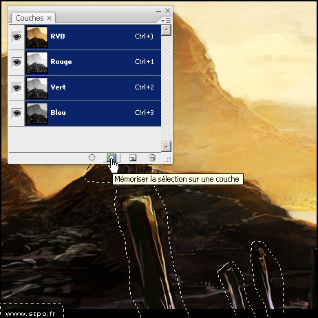
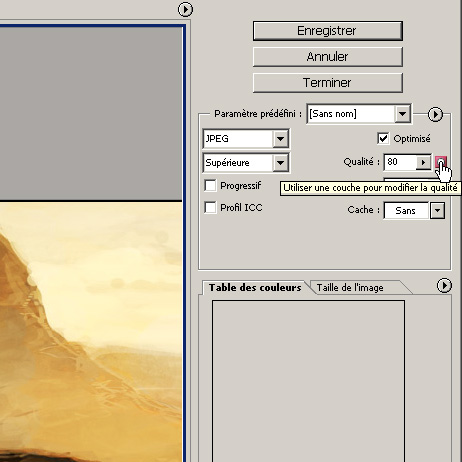
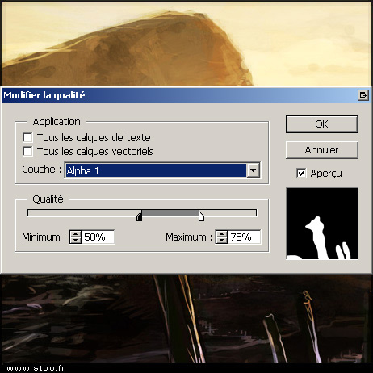

Contenus plus petits
====================

Les deux chapitres précédents ont permis de travailler avec 
moins de requêtes HTTP. L'étape suivante est de diminuer le poids 
des composants ou des lots de composants qui restent à télécharger. 
Le poids moyen d'une page était de 500 Ko en 2009 mais la plupart 
des pages riches dépassent désormais facilement ce palier. 

Compression HTTP
----------------

La première solution pour diminuer le poids des composants à 
télécharger est presque magique. Elle permet d'obtenir des 
gains de l'ordre de 70 % sur le code HTML, CSS ou javascript et prend 
tout au plus quelques heures à mettre en place. 

### Gain en performance

Diviser par quatre le volume des contenus textuels c'est presque 
50 % de gagnés sur la totalité du site. Pour le visiteur le gain 
est immédiatement visible. Netflix a pu constater des améliorations 
de l'ordre de 25 % sur le temps de chargement complet de ses pages 
web après activation de la compression. 

Outre le gain de performance dû au temps de téléchargement, il 
y aussi pour vous un gain financier immédiat, dû à la bande passante 
utilisée. Si vous divisez par deux le volume échangé par votre 
serveur, vous divisez aussi par deux les coûts associés. L'outil 
[http://www.port80software.com/tools/bandwidthcalchz.asp](http://www.port80software.com/tools/bandwidthcalchz.asp) 
vous permet de calculer immédiatement les sommes épargnées 
annuellement. 

Le gain en performance vient aussi avec son coût. La compression 
par le serveur web et la décompression par le navigateur nécessitent 
toutes les deux du temps processeur. Sur le navigateur on considère 
habituellement que le coût est nul. La décompression est une 
tâche très aisée et le gain dépasse très largement les quelques 
millisecondes d'occupation processeur. Côté serveur la compression 
n'est pas à coût nul, et prendra quelque chose comme 5 % du processeur. 
C'est cependant probablement négligeable au regard des gains. 

**Recommandation** : Activer la compression HTTP sur votre 
serveur web, au moins pour les contenus statiques à base de texte 
(css et javascript par exemple). 

### Fonctionnement

Le protocole HTTP qui assure les échanges entre le navigateur 
et le serveur web a déjà prévu la possibilité de compresser les 
contenus avant envoi. 

#### Algorithmes

Les algorithmes utilisés sont extrêmement proches du très courant 
zip que vous utilisez pour les documents de votre poste de travail. 
Il s'agit de gzip (RFC 1951 et 1952), deflate (RFC 1951 et 1950) 
et compress. En fait compress est quasiment inutilisé dans les 
échanges web et les deux autres sont à peu près équivalents, gzip 
n'est qu'une variation de deflate avec des méta-données. 

#### Auto-négociation

1. Le navigateur commence par envoyer une entête particulière 
   quand il envoie sa requête. Il s'agit de l'entête `Accept-Encoding`. 
   Le plus souvent la valeur est « gzip, deflate », qui signale 
   que le navigateur supporte ces deux algorithmes. 

~~~~~~~ {.http .request}
GET / HTTP/1.1
Accept: image/gif, image/jpeg, application/x-shockwave-flash, */*
Accept-Language: fr
UA-CPU: x86
Accept-Encoding: gzip, deflate
User-Agent: Mozilla/4.0 (compatible; MSIE 7.0; Windows NT 5.1)
Host: www.yahoo.fr
Connection: Keep-Alive
~~~~~~~

2. Le serveur repère cette entête et peut choisir d'utiliser 
   un de ces deux algorithmes pour compresser le contenu juste 
   avant de l'envoyer. Si c'est le cas il ajoute alors l'entête 
   `Content-Encoding` pour informer le navigateur qu'il a 
   effectivement compressé les données et avec quel algorithme. 

~~~~~~~ {.http .response}
HTTP/1.1 200 OK
Date: Mon, 30 Aug 2010 16:21:10 GMT
Cache-Control: private
Vary: Accept-Encoding
Content-Type: text/html;charset=utf-8
Content-Encoding: gzip
Age: 0
Transfer-Encoding: chunked
Connection: keep-alive

<!DOCTYPE......
~~~~~~~

3. Enfin, le navigateur télécharge le contenu et le décompresse 
   avant de l'utiliser. 

Tout est géré par le navigateur et le serveur web. Si l'un des deux 
ne supporte pas ou ne veut pas de la compression alors il n'y aura 
pas mention de gzip ou de deflate dans les entêtes HTTP et le contenu 
sera envoyé décompressé. Le mécanisme ou sa présence est totalement 
transparent pour l'utilisateur. Seuls les temps de téléchargements 
réduits peuvent permettre de faire la différence. 

#### Interactions avec les caches

Dans l'exemple ci-avant le serveur a aussi ajouté `Accept-Encoding` 
dans l'entête `Vary`. Cela permet d'informer les différents 
que la réponse, compressée, n'est valable que pour les futures 
requêtes qui ont la même entête Accept-Encoding, donc qui ont 
le même support de compression. Si ce n'est pas le cas, la réponse 
ne devra pas être réutilisée (on risquerait d'envoyer une réponse 
compressée à un navigateur ne la supportant pas) et la requête 
doit être de nouveau réalisée. 

### Mise en place

La mise en place de la compression HTTP est généralement l'affaire 
de quelques lignes dans la configuration du serveur web. Quasiment 
tous ont un module intégré ou une extension pour gérer la compression : 

#### Apache 1.3

Apache 1.3 utilise le mod_gzip. Ce dernier n'est pas fourni avec 
le serveur web mais la plupart des distributions Linux le proposent 
dans les paquets disponibles. 

* [http://www.schroepl.net/projekte/mod_gzip/](http://www.schroepl.net/projekte/mod_gzip/) 

Pour une configuration minimale il suffit d'activer le module 
et d'ajouter quelques lignes dans la configuration Apache : 

~~~~~~~ {.apache .partial}
LoadModule gzip_module modules/mod_gzip.so
<IfModule mod_gzip.c>
  mod_gzip_on  Yes
  mod_gzip_item_include mime ^text/
  mod_gzip_send_vary On
</IfModule>
~~~~~~~

Par défaut les fichiers sont recompressés à chaque accès. En 
spécifiant un répertoire temporaire, on pourra mettre en cache 
les fichiers statiques compressés pour éviter de faire plusieurs 
fois le même travail : 

~~~~~~~ {.oneline .apache .partial}
mod_gzip_temp_dir /tmp
~~~~~~~

Il aussi est possible de pré-compresser les contenus statiques 
et de demander à mod_gzip de les utiliser au lieu de les compresser 
lui-même. Ici on utilise l'extension `.gz` : 

~~~~~~~ {.apache .partial}
mod_gzip_can_negotiate Yes
mod_gzip_static_suffix .gz
AddEncoding gzip .gz
mod_gzip_update_static Yes
~~~~~~~

Si le fichier compressé est plus vieux que le fichier original, 
c'est ce dernier qui est utilisé par Apache, pour éviter les erreurs 
de mises à jour. La dernière des quatre directives précédentes 
permet de mettre à jour les fichiers compressés automatiquement 
si nécessaire. 

Afin d'éviter d'occuper Apache inutilement on définit généralement 
une taille minimale au-deçà de laquelle il n'est pas utile de 
compresser. On peut aisément définir ce minimum à 1 Ko étant donné 
qu'un seul paquet TCP/IP. On définit la taille maximum des fichiers 
à compresser (pour ne pas tenter de compresser un fichier trop 
important en volume) et l'occupation maximum en mémoire (au-delà 
les fichiers sont compressés dans un répertoire temporaire) : 

~~~~~~~ {.apache .partial}
mod_gzip_minimum_file_size    1000
mod_gzip_maximum_file_size    500000
mod_gzip_maximum_inmem_size   600000
~~~~~~~

Enfin, on peut inclure ou exclure des contenus en fonction de 
leur nom de fichier, de leur type mime, ou du module responsable 
de leur gestion dans Apache. Le dernier paramètre de ces directives 
est toujours une expression rationnelle : 

~~~~~~~ {.apache .partial}
mod_gzip_item_include file \.html$
mod_gzip_item_include file \.css$
mod_gzip_item_include file \.js$
mod_gzip_item_include file \.xml$
mod_gzip_item_include file \.svg$
mod_gzip_item_exclude file \.mhtml$
mod_gzip_item_exclude handler    ^cgi-script$
mod_gzip_item_include mime ^text/
mod_gzip_item_include mime ^application/.*xml$
mod_gzip_item_exclude mime ^image/
~~~~~~~

#### Apache 2.x

Contrairement à Apache 1.3, Apache 2.x a un module officiel pour 
la gestion de la compression HTTP, le mod_deflate. Il n'est malheureusement 
pas activé par défaut et c'est à vous de le faire. 

* [http://httpd.apache.org/docs/2.0/mod/mod_deflate.html](http://httpd.apache.org/docs/2.0/mod/mod_deflate.html) 

Une fois le module chargé il suffit de déclarer le filtre « deflate » 
pour tous les types de fichiers souhaités : 

~~~~~~~ {.apache .partial}
AddOutputFilterByType DEFLATE text/html text/plain text/xml 
AddOutputFilterByType DEFLATE text/javascript application/javascript
AddOutputFilterByType DEFLATE text/css application/x-javascript
AddOutputFilterByType DEFLATE application/xml application/xhtml+xml
AddOutputFilterByType DEFLATE image/svg+xml application/rss+xml
~~~~~~~

Il est possible de choisir le niveau de compression (de 1 le plus 
faible à 9 le plus efficace) pour les contenus. Une compression 
faible sera suffisante et occupera bien moins le processeur. 
Il n'est pas recommandé d'essayer les niveaux les plus élevés 
: 

~~~~~~~ {.oneline .apache .partial}
DeflateCompressionLevel 3
~~~~~~~

#### Lighttpd

Pour Lighttpd c'est le module mod_compress qui s'occupe de la 
compression des contenus statiques. Un module mod_deflate 
existe aussi pour les versions les plus récentes de Lighttpd 
mais il ne permet pas le cache des contenus compressés. 

* [http://redmine.lighttpd.net/wiki/1/Docs:ModCompress](http://redmine.lighttpd.net/wiki/1/Docs:ModCompress) 

La liste des contenus à compresser est fixée par la directive 
`compress.filtype` : 

~~~~~~~ {.oneline .lighttpd .partial}
compress.filetype  = ("text/plain", "text/html")
~~~~~~~

Les contenus sont par défaut compressés à chaque requête. Pour 
éviter de recompresser des milliers de fois le même fichier statique 
Lighttpd nous permet de spécifier un répertoire où seront mis 
en cache les résultats de compression : 

~~~~~~~ {.oneline .lighttpd .partial}
compress.cache-dir = "/var/www/cache/"
~~~~~~~

Enfin, une dernière directive permet de désactiver la compression 
pour les fichiers trop volumineux. Le module contient une limite 
haute native de 128 Mo mais il est probablement une bonne idée 
de la réduire drastiquement : 

~~~~~~~ {.oneline .lighttpd .partial}
compress.max-filesize = 1000 # en Ko
~~~~~~~

#### IIS

Le module de compression est livré par défaut avec IIS. Il vous 
suffit de vous rendre dans l'outil de gestion IIS, dans l'onglet 
« services » des propriétés du site web. 

* [http://www.microsoft.com/technet/prodtechnol/WindowsServer2003/Library/IIS/25d2170b-09c0-45fd-8da4-898cf9a7d568.mspx](http://www.microsoft.com/technet/prodtechnol/WindowsServer2003/Library/IIS/25d2170b-09c0-45fd-8da4-898cf9a7d568.mspx) 

Il est aussi possible d'activer la compression via deux lignes 
de commande : 

~~~~~~~ {.oneline .wshell}
cscript adsutil.vbs set w3svc/filters/compression/parameters/HcDoStaticCompression true
~~~~~~~

~~~~~~~ {.oneline .wshell}
cscript adsutil.vbs set w3svc/filters/compression/parameters/HcDoDynamicCompression true
~~~~~~~

Si vous activez la compression des contenus statiques (ce qui 
est le minimum recommandé), vous pouvez spécifier un répertoire 
où seront stockés les fichiers compressés. Cela évitera de les 
recompresser si c'est déjà fait. L'adresse de ce répertoire 
est déterminée par la directive metabase `HcCompressionDirectory`. 

La liste des extensions des contenus à compresser est réglée 
par les directives metabase `HcFileExtensions` (contenus 
statiques) et `HcScriptFileExtensions` (contenus dynamiques). 
De même il est possible de régler séparément le niveau de compression 
pour les contenus statiques (`HcOnDemandCompLevel`, 10 par 
défaut) et dynamiques (`HcDynamicCompressionLevel`, 0 par 
défaut, valeur minimum). 

Attention ! Lorsque vous activez la compression les valeurs 
par défaut des entêtes de cache (paramètres metabase `HcExpiresHeader`, 
`HcCacheControlHeader`, et `HcSendCacheHeaders`) sont réglés 
pour désactiver tout cache par les proxy et les navigateurs. 

Pour faciliter, il existe des modules tierces qui permettent 
de gérer tout cela plus simplement. C'est par exemple le cas de 
IIS Accelerator : 

* [http://www.vigos.com/products/iis-accelerator/](http://www.vigos.com/products/iis-accelerator/) 

#### Nginx

Dans Nginx la compression est gérée par le module HttpGzip. On 
spécifie alors trois lignes, respectivement pour activer la 
compression, définir les types des contenus à compresser, et 
la taille minimale d'un fichier pour le prendre en compte : 

~~~~~~~ {.nginx .partial}
gzip             on;
gzip_types       text/plain application/xml text/css;
gzip_min_length  1000;
~~~~~~~

Par défaut la compression est faite à chaque requête. Le module 
HttpGzipStatic permet d'utiliser des versions précompressées 
sur disque. Dans ce cas Nginx recherche un fichier de même nom avec 
en plus le suffixe « .gz ». On active ce support avec une simple 
ligne de configuration : 

~~~~~~~ {.oneline .nginx .partial}
gzip_static      on;
~~~~~~~

#### Contenus dynamiques

Si Apache permet de compresser les contenus dynamiques, on se 
contente normalement de ne gérer que les contenus statiques. 
C'est alors à vous de gérer les contenus dynamiques (PHP, Ruby, 
Java, Python) en ajoutant un filtre là où c'est pertinent. Le 
faire manuellement vous permet de gérer le cache et son expiration 
précisément, ce que le serveur web ferait avec difficulté pour 
un contenu dynamique. 

Pour PHP il suffit de modifier le fichier de configuration php.ini 
et d'ajouter ou d'activer la directive `lib.output_compression`. 
Si on spécifie une valeur numérique, elle correspondra à la taille 
du tampon de sortie qui permet de compresser au fil de l'eau au 
lieu de gérer tout le contenu en mémoire (4 Ko par défaut). Il est 
aussi possible (mais moins recommandé) de l'activer au besoin 
lors de l'exécution à l'aide de `ob_start("ob_gzhandler")`. 

~~~~~~~ {.online .phpconf .ini}
zlib.output_compression = On 
~~~~~~~

Pour Django il faut simplement ajouter le module gzip dans le 
middleware : 

~~~~~~~ {.django .partial}
MIDDLEWARE_CLASSES = (
      'django.middleware.gzip.GZipMiddleware',
      …
)
~~~~~~~

#### Solutions tierces

Enfin, il est possible de désactiver totalement la compression 
HTTP sur vos serveurs applicatifs et dans les applications elles-même. 
C'est alors à un boitier qui se branche entre votre serveur web 
et Internet qu'est dévolue la tâche de réaliser la compression. 

Il existe de nombreux boitiers qui réalisent cette opération, 
et bien d'autres en même temps (gestion de la sécurité ssl, recompression 
des images, proxy cache, etc.). On peut par exemple citer ActivNetworks 
en France. 

Vous pouvez cependant faire vous-même un montage similaire 
avec serveur en proxy inverse qui ajoute un filtre de compression 
avant de renvoyer les résultats. Apache, Nginx, Varnish ou Squid avec 
le module ecap-gzip ([http://code.google.com/p/squid-ecap-gzip/](http://code.google.com/p/squid-ecap-gzip/)) 
conviennent parfaitement. 

### Quoi compresser

#### Formats de fichier

Les algorithmes de compression utilisés sont extrêmement performants 
pour les fichiers textes classiques. C'est le cas des fichiers 
html, css, javascript, xml, etc. Pour ces fichiers, même un niveau 
de compression minimum obtient de très bons résultats. 

Côté web on peut identifier les types mimes suivants : 

* text/plain, 

* text/html, 

* application/xhtml+xml, 

* text/css, 

* text/javascript, 

* application/x-javascript, 

* application/javascript, 

* application/json, 

* text/xml, 

* application/xml, 

* application/rdf+xml, 

* application/rss+xml, 

* application/atom+xml. 

On peut normalement sans trop de risques ajouter tous les types 
text/* et probablement tous les types application/*+xml. On 
devrait aussi pouvoir compresser efficacement les images svg 
(image/svg+xml) mais ces dernières peuvent déjà être compressées 
(fichiers en .svgz) sans que cela ne se voit sur le type mime. 

Les images (.bmp exclus mais on n'en trouve normalement pas sur 
le web), vidéos et musiques sont des formats déjà compressés 
avec des algorithmes dédiés. Tenter de les recompresser n'amènerait 
aucun gain et occuperait votre processeur pour rien. 

Les fichiers bureautiques récents sont déjà compressés avec 
un algorithme similaire à gzip. C'est le cas des fichiers OpenOffice 
(odt, ods, odp, odg...) et des fichiers Microsoft Office récents 
(xlsm, xlsx, docx, pptx). Ils sont à exclure de la compression 
HTTP. 

Les fichiers bureautiques plus anciens (xls, doc, ppt) et les 
PDF, eux, peuvent souvent diminuer après un passage par gzip. 
Le gain est toutefois bien plus faible que sur les fichiers textes 
aussi c'est à vous de vérifier si échanger quelques cycles processeur 
vaut le coup. 

Pour les polices de caractères, les polices eot, otf, et ttf peuvent 
souvent être compressées. Les woff le sont cependant déjà, et 
doivent donc être exclues pour ne pas ralentir inutilement vos 
serveurs. 

#### Types de contenu

En plus de la différenciation suivant le format du fichier, on 
fait habituellement une différence suivant le type de contenu, 
statique ou dynamique. Vous pouvez activer la compression des 
contenus statiques sans avoir de doute. Le cache du serveur web 
permettra de limiter la pénalité processeur tout en réduisant 
le volume de données échanger. C'est un des meilleurs retours 
sur investissement en terme de performance si on compte faible 
investissement humain pour la mise en œuvre. 

Pour les contenus dynamiques il s'agit de faire un compromis 
entre le processeur du serveur et le gain en volume parce que le 
résultat de la compression ne pourra pas être mis en cache. La 
plupart des sites à très fort trafic choisissent de désactiver 
la compression HTTP des contenus dynamiques, c'est à dire de 
la page HTML initiale et des éventuelles données json échangées 
à l'aide de requêtes ajax. 

Si vous pouvez le permettre, tentez d'activer la compression 
des contenus dynamiques, mais ne luttez pas inutilement si vous 
dégradez les performances de votre serveur, il y a d'autres recommandations 
utiles dans ce livre. 

### Support des navigateurs

Tous les navigateurs récents supportent la compression HTTP 
avec gzip ou deflate, et ce depuis Microsoft Internet Explorer 
4 et Netscape 4. Seuls restent quelques mauvais navigateurs 
mobiles comme certains Blackberry. Ce n'est toutefois pas un 
problème grâce au mécanisme d'auto-négociation : Si un navigateur 
ne supporte pas la fonctionnalité il n'annonce pas le support 
de gzip ou de deflate dans les entêtes HTTP et le serveur web ne 
déclenchera pas la compression. 

Les seuls problèmes viennent des navigateurs qui annoncent 
supporter la compression mais qui ont des défauts dans leur gestion. 
C'était le cas pour les images dans Netscape 4 par exemple, mais 
comme il est de toutes façons conseillé de désactiver la compression 
HTTP des images, cela n'entraîne pas d'incompatibilités. Microsoft 
Internet Explorer 4 et 5 ont aussi un défaut qui désactive le cache 
quand ils reçoivent un contenu compressé mais vu la faible part 
de marché et que le visiteur obtient quand même la page correctement, 
c'est un défaut souvent jugé comme négligeable. 

#### Support non déclaré

La surprise vient en fait du nombre de visiteurs qui déclarent 
ne pas supporter la compression. Ils peuvent représenter jusqu'à 
15 % des visites uniques. Il s'agit en fait de deux catégories 
bien identifiées : 

* les utilisateurs avec des proxy, anti-virus, anti-malware, 
  outils de respect de la vie privée, et autres logiciels intermédiaires 
  mal configurés ; 

* les utilisateurs de Microsoft Internet Explorer 6 derrière 
  un proxy (un défaut fait qu'il ne déclare pas toujours le support 
  de la compression dans ce cas). 

Majoritairement il s'agit d'utilisateurs en entreprise, fortements 
bridés, avec Microsoft Internet Explorer 6, et un proxy d'entreprise 
trop agressif. 

Il devrait être possible d'envoyer quand même du contenu compressé 
aux seconds, et probablement à la majorité des premiers, mais 
il n'y a malheureusement pas de solution efficace pour les détecter 
simplement dans le serveur web. 

Google a développé un test applicatif à base de cookie, javascript 
et iframe : Si le navigateur ne déclare pas supporter la compression 
HTTP et qu'aucun cookie au nom de « gzip » n'est présent, on insère 
ce cookie avec une valeur 0 et on ajoute une iframe spécifique. 
Cette iframe est envoyée compressée quelle que soit la déclaration 
du navigateur, et exclue de tout cache (`Cache-Control: no-cache`). 
Google a aussi remarqué qu'il était très important que l'adresse 
de la page présente l'extension « .html » pour certains proxys 
dans le cadre de ce test. Un javascript dans l'iframe modifie 
le cookie pour y mettre la valeur 1. Si la page compressée est correctement 
décodée le cookie passe donc à 1, sinon il reste à 0. Par la suite 
on peut activer la compression pour les navigateurs qui ont ce 
cookie à 1, même s'ils ne déclarent pas le support de la compression 
HTTP. 

D'autres considèrent que seuls les scripts réalisés à la main 
ne supportent pas toujours la compression mais que c'est toujours 
le cas pour les navigateurs réels et activent la compression 
pour les navigateurs connus (en se basant sur l'entête User-Agent), 
y compris quand ils n'en déclarent pas le support. Cette démarche 
est toutefois déconseillée car elle laissera forcément quelques 
visiteurs sur le bord de la route, même s'ils seront rares. 

Optimisation des images
-----------------------

La compression HTTP permet de diminuer le volume des données 
textuelles. Comme nous l'avons vu ça ne concerne pas les images, 
qui sont déjà compressées. Ces dernières représentent de 30 
% à 80 % du poids total d'une page web. La moindre optimisation 
impactera donc directement le temps de chargement et les performances 
du site. 

Heureusement tout n'est pas perdu. Nous allons voir que nous 
avons de multiples leviers pour optimiser le poids des images : 

### Format des images

Il existe quatre formats d'images courants sur le web : JPEG, 
SVG, GIF et PNG. 

Le jpeg est un format adapté pour les photos, avec des millions 
de couleurs différentes et des zones où on a toute une variation 
autour d'un même jeu de couleurs (pensez aux couleurs chair d'un 
visage). Lors de l'enregistrement d'un fichier jpeg le logiciel 
va supprimer certains détails peu importants dans le cadre d'une 
photo (il est peu important que le pixel soit exactement de la 
bonne couleur, tant que le ton, la saturation et la luminance 
sont proches). Si on utilise des réglages trop agressifs ou une 
image autre qu'une photo (par exemple un logo avec du texte) on 
verra très rapidement la dégradation en qualité. 

Le svg est un format un peu à part. Il n'enregistre pas la couleur 
de chaque pixel mais directement les formes (courbe, ligne, 
rectangle, cercle, etc.), sous forme XML. On parle de vecteurs, 
et d'image vectoriel. Il est impossible de représenter une photo 
ainsi mais en échange les logos ou les images créées à partir de 
formes et de courbes peuvent être représentés avec une grande 
fidélité quelle que soit la taille de l'image. On peut zoomer 
à l'infini sans jamais voir de pixelisation. Comme il s'agit 
d'un fichier qui contient du texte (du code XML), il est possible 
de le compresser avec zip. On lui donne alors généralement l'extension 
.svgz. 

Les formats gif et png sont deux formats concurrents ayant le 
même but. À l'inverse de jpeg le format ne dégrade en rien l'image, 
qui reste fidèle au pixel près à celle d'origine. En conséquence 
ils sont forcément bien plus volumineux que les jpeg pour représenter 
de simples photos. Leur domaine de prédilection ce sont les logos, 
les textes et les petits éléments d'interface graphique où il 
est important que les couleurs ou les délimitations soient fidèles. 
Ils arrivent aussi très bien à compresser les dégradés. 

#### Choisir le bon type d'image

Choisir le bon type d'image est un premier pas qui permet d'éviter 
des images inutilement volumineuses. 

Tout d'abord, tout ce qui est dès le départ réalisé en mode vectoriel 
devrait rester dans le format svg. Quand cela est possible les 
graphiques statistiques (en barres, en camenbert, en courbes) 
sont aussi de très bons candidats au svg. 

Ensuite, les logos, les visuels contenant du texte à lire, et 
les petits éléments d'interface (souvent de gros aplats d'une 
seule couleur ou des dégradés, avec des couleurs qui doivent 
être exactes sous peine de provoquer un rendu disgracieux) devraient 
être en png. C'est aussi le seul format non vectoriel fiable sur 
le web pour avoir de la transparence. Il s'agit généralement 
de petites images, souvent avec peu de couleurs. 

Enfin, et il ne devrait rester plus que ça, tout ce qui est créé 
à partir de photos ou de dessins doit être réalisé à l'aide d'images 
jpeg. 

**Recommandation** : Vérifier que toutes les images créées 
à partir de formes vectorielles qui le peuvent sont sauvegardées 
en svg ; que les images de logo, contenant du texte ou des gros aplats 
de couleurs unie sont en png ; et que les photos et dessins sont 
en jpeg. 

#### Gif ou png

Vous l'avez peut être remarqué, je n'ai rien recommandé pour 
gif. Gif et png sont des formats concurrents avec les mêmes objectifs. 
Gif est un peu plus ancien, limité à 256 couleurs, et a longtemps 
posé des problèmes de brevet. Png est plus récent, permet de se 
limiter à 256 couleurs mais aussi d'étendre à des millions de 
couleurs si l'on souhaite, et sait gérer une opacité variables 
sur chaque pixel (là où gif ne sait faire que de la couleur pleine 
ou du transparent total). 

Si je n'ai rien recommandé pour gif, c'est que png sait faire tout 
ce que sait faire gif, en propose encore plus, et obtient des fichiers 
moins volumineux. Le plus souvent sauvegarder en png un ancien 
fichier gif permet un gain non négligeable en poids (de l'ordre 
de 10 à 30 %). Il arrive parfois que ce soit l'inverse, mais dans 
ce cas la différence est de quelques octets et c'est souvent sur 
les toutes petites images où ça ne fait pas grande différence. 

Vous pouvez sans craintes passer tous vos gif en png et vous serez 
sûrs d'y gagner. Si vous souhaitez le faire en masse, l'outil 
imagemagick permet d'automatiser cela. 

**Recommandation** : Convertir toute les images gif non animées 
en fichiers png. 

En fait il reste un cas où gif peut être adapté, c'est pour les images 
animées. Originellement c'est quelque chose que png ne supporte 
pas, et donc où le format gif reste préconisé. Mozilla a toutefois 
proposé une évolution du png, le pnga, qui permet les animations 
(et qui reste compatible avec les anciens navigateurs, ces derniers 
afficheront simplement l'image non animée). 

### Recompression

Tout d'abord le plus simple pour gagner en poids sur une donnée 
compressée est de la recompresser, avec un meilleur algorithme 
ou des réglages plus agressifs. C'est ce que nous ferons en premier 
pour certaines de nos images. 

Si la solution paraît naïve il s'avère que les gains sont réels. 
Les outils de traitements d'image comme Adobe Photoshop utilisent 
en réalité des algorithmes ou des paramètres peu optimisés pour 
une diffusion web. En repassant derrière on peut gagner de 10 
à 50 % suivant les images. Comme les images représentent plus 
d'un tiers du poids total d'un site, une simple optimisation 
des images peut permettre de retirer 10 % du volume de téléchargement 
total. 

Cette possibilité de recompression est offerte avec les formats 
sans pertes, c'est à dire PNG, GIF et SVG. Sur ces formats l'images 
est exactement la même avant et après sa compression, au pixel 
près. Recompresser l'image se fait donc sans aucun compromis 
de qualité. On ne touchera par contre pas aux fichiers jpeg, qui 
eux subissent une dégradation à chaque compression, et donc 
qui subiraient une perte de qualité. 

#### Recompresser les png

Recompresser un png est l'histoire d'une ligne de commande. 
De nombreux outils existent pour automatiser cette tâche. Les 
plus connus sont pngcrush et optipng. Il existe aussi un service 
web, punnypng, qui permet d'optimiser ses images via une API. 
Ce dernier offre plus que la simple recompression mais impose 
d'être dépendant d'un service externe. 

* [http://pmt.sourceforge.net/pngcrush/](http://pmt.sourceforge.net/pngcrush/) 

* [http://optipng.sourceforge.net/](http://optipng.sourceforge.net/) 

* [http://www.punypng.com/](http://www.punypng.com/) 

Ces outils sont très intéressants car ils peuvent faire partie 
de votre processus de mise en production : Lorsque les fichiers 
sont packagés pour être mis en production un script passe toutes 
les images par pngcrush ou optipng pour les optimiser. 

Il n'est pas forcément utile d'utiliser les réglages les plus 
agressifs de ces outils. Les gains supplémentaires ne sont que 
de quelques octets et le temps nécessaire passe de quelque secondes 
à plusieurs minutes, voire dizaines de minutes. Le réglage par 
défaut obtient déjà de très bons résultats et offre le meilleur 
rapport efficacité/temps. 

**Recommandation** : Recompresser toutes les images png avec 
optipng. 

S'il s'agit de simplement vérifier l'état d'une page ou de faire 
des essais, vous pouvez aussi simplement utiliser les extensions 
Yslow (qui embarque l'outil en ligne smushit) et Google Page 
Speed. Les deux vous permettent d'analyser toutes les images 
d'une page de Firefox et de récupérer les images optimisées avec 
des statistiques sur les gains réalisés. 

* [http://developer.yahoo.com/yslow/](http://developer.yahoo.com/yslow/) 

* [http://code.google.com/intl/fr/speed/page-speed/](http://code.google.com/intl/fr/speed/page-speed/) 

Si seules les statistiques vous intéressent, web page test permet 
d'analyser une URL et vous liste les gains possibles sur chaque 
image, avec un cumul à la fin. 

* [http://www.webpagetest.org/](http://www.webpagetest.org/) 

Il peut être intéressant de noter ou Yslow, Page Speed, web page 
test, et même punnypng utilisent tous pngcrush ou optipng en 
interne. Seules les options et les traitements annexes changent. 
Les gains sont parfois différents mais généralement du même 
ordre de grandeur. Seul punnypng va parfois un peu plus loin suite 
aux différentes actions qu'il réalise en plus. 

#### Recompresser les svg

Les images svg se compressent et décompressent avec n'importe 
quel outil de gzip. Si elles ne sont pas compressées il suffit 
de les faire passer par gzip et d'en changer l'extension pour 
.svgz. Si elles sont déjà compressées vous pouver les décompresser 
pour relancer l'opération avec des paramètres plus agressifs. 

Si vous avez suivi les recommandations de compression HTTP précédentes, 
votre serveur web utilise de toutes façons gzip pour vos fichiers 
svg. Il n'est donc pas forcément important de réaliser ces recompressions 
à la main. 

### Méta-données

Le troisième levier pour l'optimisation des images est celui 
de la suppression des méta-données. Les fichiers d'images contiennent 
en effet bien plus que les données graphiques. On y trouve des 
descriptions, le nom des logiciels utilisés, des informations 
sur les profils de couleurs du poste de travail d'origine, parfois 
des données de localisation, des informations sur l'appareil 
qui a servi à la prise de vue dans le cas d'une photo, des dates de 
modification, de création, et en cherchant bien on trouve même 
des photos avec une capture sonore embarquée. 

Tous les formats de fichiers sont ici concernés, même si les méta-données 
présentes dans chacun diffèrent. 

#### Png

Pour png les mêmes outils que précédemment font aussi le travail : 
pngcrush, optipng, et punnypng. Il n'y a donc pas besoin d'une 
opération supplémentaire si vous avez déjà exécuté l'un d'eux. 

#### Jpeg

Pour jpeg on peut utiliser jpegtran, jhead ou jpegoptim pour 
les supprimer. Aucun de ces outils ne touche à l'image elle-même, 
donc il n'y a aucun risque de dégradation de la qualité. 

* [http://sylvana.net/jpegcrop/jpegtran/](http://sylvana.net/jpegcrop/jpegtran/) 

* [http://www.sentex.net/~mwandel/jhead/](http://www.sentex.net/~mwandel/jhead/) 

* [http://freshmeat.net/projects/jpegoptim](http://freshmeat.net/projects/jpegoptim) 

**Recommandation** : Retirer les méta-données des images jpeg 
à l'aide de jpegtran. 

#### Copyright, licences

Lorsque le premier outil en ligne d'optimisation d'image a été 
publié, il y a eu une levée de boucliers contre la suppression 
des méta-données. Les associations d'auteurs et de photographes 
se sont plaints que ces opérations modifiaient les images et 
de plus retiraient potentiellement les mentions d'auteur, 
de copyright, ou de licence d'utilisation. 

Si vous cherchez à supprimer des données d'une image, assurez-vous 
en effet d'en avoir le droit, surtout si vous publiez ensuite 
cette image sur Internet. Vérifiez que vous en êtes l'auteur, 
ou que les conditions d'utilisations de l'image et le contexte 
légal vous en donnent le droit. Si l'image appartient à un tiers, 
il est probable que vous soyez obligés d'au moins laisser les 
mentions de copyright et le nom de l'auteur, peut être plus. 

### Qualité de l'image

Jusqu'à présent, en parlant format, compression ou méta-données, 
nous parlions de réduire le poids des images à qualité fixe. La 
qualité fixe est importante pour convaincre les graphistes 
et toute la chaîne décisionnelle qu'un site qui répond rapidement 
n'est pas forcément un site moche. La qualité graphique est aussi 
nécessaire, comme un moyen de porter l'information et d'accompagner 
le visiteur. 

Il est cependant aussi important de réfléchir à cette qualité 
graphique, de la discuter. Est-ce vraiment nécessaire que le 
bandeau de haut de page soit dans une si bonne définition ? Vaut-il 
mieux une superbe image qui mette une seconde à charger ou une 
image de moindre qualité qui soit instantanée ? 

Il n'y a certainement pas de réponse toute faite et je serai le 
dernier à vous demander de trancher systématiquement en faveur 
des performances. À l'inverse, si vous ne vous posez pas ces questions 
sérieusement et si la qualité graphique n'est jamais remise 
en question, alors vous avez un biais opposé, qui n'est pas meilleur. 

Il y a deux moyens d'action pour jouer sur la qualité d'une image 
web : la palette de couleurs, et la force de compression jpeg. 

#### Palette de couleurs

La palette de couleurs c'est simplement l'index de toutes les 
couleurs utilisées dans votre image. S'il y a seulement 256 couleurs, 
alors on peut coder chaque pixel sur un seul octet. Si on utilise 
toute l'étendue de la gamme informatique alors non seulement 
il en faut le triple mais en plus la faible répétition des couleurs 
permettra d'obtenir une bien moins bonne compression au final. 

C'est cette palette de couleurs qui fait que les images gif semblent 
toujours dégradées. Le format ne permet que 256 couleurs. Il 
faut donc modifier l'image et convertir certains pixels dans 
une couleur approchante. L'image finale a subit une détérioration 
avant sa sauvegarde. 

Quand vous construisez une image png, de combien de couleurs 
avez-vous besoin ? Une première étape est de vérifier que vous 
utilisez effectivement plus de 256 couleurs. Sinon, vous pouvez 
demander à votre logiciel d'édition d'images de réduire sa palette 
au nombre réel de couleurs. Étrangement, la plupart de ces logiciels 
ne font pas l'opération si vous ne le demandez pas. Sous Adobe 
Photoshop cela s'appelle indexer les couleurs (puisqu'on créé 
un index de toutes les couleurs utilisées). 

Ensuite la question est de savoir si on ne peut pas réduire encore 
les couleurs. Si deux couleurs de vert dans l'image sont très 
approchantes, peut-on utiliser le même aux deux endroits ? Le 
« enregistrer pour le web » d'Adobe Photoshop permet de tester 
plusieurs combinaisons et d'en comparer le résultat avant de 
choisir. Faites cependant très attention : L'oeil humain est 
très bon pour comparer, mais se laisse facilement tromper quand 
il n'a qu'un seul échantillon sous les yeux. En comparant une 
images en pleines couleurs et une image en 256 couleurs côte à 
côte, il est évident que la dégradation vous paraitra gênante, 
disgracieuse. Par la suite, même en retirant de la vue l'image 
en pleines couleurs vous verrez immédiatement tous les défauts 
de l'images en 256 couleurs. 

Pourtant, faites l'expérience de mettre cette image dans vos 
pages, sans rien dire à personnes, vous verrez que pas grand monde 
ne s'en apercevra. Plus avant dans ce livre nous avions repéré 
une astuce similaire : Pour faire un bouton avec un dégradé, il 
suffit en fait de mettre une couleur claire sur la moitié haute 
et une plus foncée sur la moitié basse, et pas un réel dégradé. 
C'est ce que font beaucoup de sites web, et personne ne le remarque. 
Sachez-donc faire des compromis de qualité, ce n'est pas toujours 
négatif et cela peut vous apporter de réels gains de performance 
quand vous additionnez ceux de toutes les images. 

**Recommandation** : Réduisez à 256 couleurs ou moins la palette 
de la plupart de vos images PNG d'interface graphique. 

Adobe Photoshop, comme les autres logiciels d'édition d'image, 
vous permet de réduire le nombre de couleurs automatiquement. 
Il se charge lui même de remplacer les couleurs qui lui semblent 
proches. Cette automatisation n'est pas toujours souhaitable. 
Peut-être que le dégradé de vert est important, quand bien même 
les couleurs sont proches, et que les bleus peuvent être fusionnés 
quand bien même ils sont très différents. Les graphistes expérimentés 
choisissent eux même individuellement chaque couleur de la 
palette quand ils en ont le temps, leur permettant de faire ces 
choix cruciaux. 

Comme personne ne souhaite passer plusieurs heures à optimiser 
de simples images, je vous propose d'utiliser l'outil pngquant. 
Il sait réduire la palette en supprimant les détails inutiles 
ou invisibles à l'oeil. Le travail est souvent meilleur visuellement 
que ce que fait Photoshop. 

#### Qualité jpeg

Le second levier d'optimisation de qualité des images est le 
réglage qualité à l'enregistrement des fichiers jpeg. Comme 
on l'a vu le format jpeg est un format de compression qui dégrade 
l'image. Dans tous les logiciels d'édition d'image on vous propose 
à la sauvegarde un réglage de qualité qui va de 0 à 100% ou de 0 à 10. 
Il informe le logiciel du niveau de dégradations que l'on est 
prêt à accepter. 

Régler la qualité à 100 n'a virtuellement aucun intérêt pour 
le web. Jusqu'à 90 % aucune différence n'est généralement visible 
à l'oeil nu. Le plus souvent 80 % est un réglage par défaut qui permet 
d'avoir une image de très bonne qualité. Vous pouvez assez souvent 
descendre jusqu'à 70 % pour des illustrations sans que cela soit 
vraiment gênant. 

La première étape est donc de vérifier quelle est la qualité de 
vos jpeg, et si baisser en qualité est acceptable ou pas. Le mieux 
reste de mener cette vérification et les discussions qui suivent 
directement avec vos graphistes afin que l'image soit crée dès 
le départ avec le bon niveau de qualité plutôt que de l'ouvrir 
pour la recompresser. Ce dernier procédé qui induirait forcément 
une perte de qualité supplémentaire inutile. 

Lors de la discussion autour de la qualité, comme précédemment, 
il ne faut pas perdre de vue qu'une différence de qualité flagrante 
et inacceptable lors d'une comparaison avec l'image originale 
ou sur le poste du graphiste pourra souvent passer inaperçue 
sur le web quand le visiteur n'a accès qu'à la version légère de 
l'image. Un test en situation réelle sans comparaison peut être 
intéressant en cas de débat. Vous devriez pouvoir ne monter au 
dessus de 80 % qu'exceptionnellement. 

Une fois le degré de qualité générale décidé il est possible d'aller 
plus loin. Le format jpeg autorise en effet des différence de 
qualité par zones dans l'image. Cela permet de s'assurer que 
l'objet principal de l'image (par exemple la pointe d'un stylo) 
soit parfait, et que le reste (stylo, fond) puisse être plus ou 
moins précis. On peut alors arriver à une qualité globale bien 
plus faible en gardant une dégradation invisible sur les zones 
qui accrochent l'oeil et qui contiennent le plus de détail. 

**Recommandation** : Réglez et diminuez la qualité de vos images 
jpeg à 80 ou 70 %, éventuellement en réservant une zone dans l'image 
avec une forte qualité pour quelques détails. 

Sous certaines versions d'Adobe Photoshop ce travail peut être 
réalisé directement par le graphiste à l'aide de calques. Lors 
de l'enregistrement « pour le web », l'outil de qualité permet 
de sélectionner un réglage différent par couche. Il suffit alors 
de copier le détail principal de l'image sur une couche à part, 
pour ensuite sélectionner une qualité de 90 % à cette couche et 
bien plus faible pour le reste de l'image. 

![Détourage d'une sélection jpeg pour en imposer la qualité[^1]](img/chap05-detourage-dune-selection-jpeg-pour-en-imposer-la-qualite1.jpg)

  [^1]: Image et captures reproduites avec l'autorisation de Christophe Andrieu ([http://stpo.fr/](http://stpo.fr/)) et Vincent Valentin ([http://www.htmlzengarden.com/](http://www.htmlzengarden.com/)) 

### Autres optimisations

Après avoir choisi le bon format, recompressé les png, retiré 
les méta-données, limité la palette au strict minimum, modifié 
avec pertinence la qualité des jpeg, il ne vous reste plus que 
quelques points à vérifier pour diminuer le poids de vos images : 

#### Taille de l'image adaptée

Tout d'abord, et même si la recommandation peut paraître superflue, 
veillez à ne pas diffuser une grande image qui sera ensuite réduite 
dans le navigateur à l'aide des propriétés HTML `width` et height 
ou de leurs équivalents CSS. 

Contrairement aux attentes ce cas se retrouve dans de nombreux 
sites. L'analyse de Google Page Speed peut vous aider à trouver 
automatiquement les cas problématiques dans vos pages. 

Le redimensionnement implique de télécharger une image plus 
volumineuse que nécessaire et en plus occupe le processeur avant 
l'affichage. Pour optimiser au mieux les performances, la taille 
native de l'image doit toujours coller exactement au pixel près 
à la taille réellement affichée dans le navigateur. Si vous avez 
besoin d'une vignette et d'une image grande taille, il est souvent 
préférable de livrer deux images plutôt que de réaliser le redimensionnement 
dans le navigateur. 

**Recommandation** : Vérifier que les images téléchargées 
sont utilisées directement dans leur taille réelle et non redimensionnées 
dans le navigateur. 

#### Pixels transparents

Le second point intéressant vient des travaux autour de l'outil 
PunnyPNG. Il s'agit de s'assurer que dans une image avec de la 
transparence, les pixels totalement transparents sont dans 
une couleur qui favorise une compression optimale. 

Ces pixels peuvent en effet, suivant le format d'enregistrement, 
garder une valeur de couleur additionnée à une valeur de transparence. 
Quand bien même la transparence serait totale, en interne une 
couleur est utilisée dans le fichier, et donc dans la compression. 
Si ces pixels utilisent de nombreuses couleurs différentes 
ils diminuent les possibilités de compression inutilement. 
Le plus simple est souvent de leur affecter une couleur unie, 
toujours la même. 

L'outil PunnyPNG fait cette opération, mais peut être réalisée 
à partir de n'importe quel éditeur d'images évolué. 

* PunnyPNG : [http://www.punypng.com/](http://www.punypng.com/) 

**Recommandation** : Utiliser PunnyPNG ou un outil équivalent 
pour s'assurer que les pixels transparents dans les PNG avec 
une couche d'opacité variable sont optimisés pour une meilleure 
compression. 

#### Animations gif

Nous avons vu précédemment que le format gif n'est conseillé 
que dans un seul cas : les images animées. Une image animée est 
constituée de multiples images qui s'affichent l'une après 
l'autre suivant une temporisation prédéfinie. 

L'outil gifsicle permet d'optimiser le poids de ces images animée 
en retirant de chaque sous-image les pixels déjà présents dans 
l'image précédente et qui n'ont pas bougé. Cette manipulation 
ne souffre d'aucun problème de compatibilité et peut être réalisée 
automatiquement par script lors de la mise en production d'une 
image. 

* Gifsicle : [http://www.lcdf.org/gifsicle/](http://www.lcdf.org/gifsicle/) 

**Recommandation** : Supprimer les pixels inutiles dans les 
images gif animées grâce à l'outil gifsicle. 

#### Espaces blancs

Enfin, et cette recommandation n'est qu'une question de bonne 
pratique, assurez-vous que vos images sont cadrées au plus juste. 
Enlevez toute bordure blanche, noire ou unie qui serait inutile. 
Ces bordures peuvent facilement être remplacées par des marges 
ou des bordures en CSS. Le poids total de vos images s'en trouvera 
allégé. 

**Recommandation** : Cadrer les images au plus juste en retirant 
les bordures unies et espaces blancs inutiles. 

### Cas particulier des favicon

Les favicon sont ces petites icônes visibles à gauche de la barre 
d'adresse dans le navigateur. Elles sont aussi visibles comme 
icône dans les favoris ou pour les rares utilisateurs qui font 
un glisser/déposer de la page vers leur bureau. 

Il s'agit habituellement de fichiers au format windows .ico, 
qui peuvent embarquer plusieurs version d'une même image à des 
résolutions différentes. Sur les navigateurs récents cela 
peut aussi être une image png ou gif, même si cette possibilité 
est rarement utilisée. 

Les navigateurs téléchargeront toujours le favicon, quoi que 
vous fassiez. Votre capacité d'intervention se limite donc 
à faire en sorte qu'il soit le plus petit possible. La différence 
entre un favicon de 300 ou de 500 octets est virtuellement nulle 
et il n'y a qu'une seule règle importante à respecter : viser une 
image qui fait au plus 1 Ko. Cette limite est dûr à TCP, pour éviter 
que le téléchargement ne nécessite plusieurs paquets réseaux. 

**Recommandation** : Supprimer les différentes résolutions 
de votre image favicon.ico pour tomber en dessous du kilo-octet. 
Seule la version 16x16 pixels est indispensable. 

Pour y arriver il suffit normalement de vérifier que votre favicon 
ne contient pas trop de versions différentes à des résolutions 
inutiles. Seule la version 16x16 pixels est nécessaire. Tout 
le reste est potentiellement superflu. Vous pouvez laisser 
quelques versions additionnelles mais seulement si ces versions 
ne vous font pas dépasser le kilo-octet. 

Minimisation des contenus texte
-------------------------------

Nous avons vu comment compresser les contenus textes avec HTTP 
au début de ce chapitre. Les résultats sont déjà importants. 
Il est toutefois possible d'aller encore plus loin avec une minimisation 
préalable. 

L'objectif de la minimisation est de supprimer les commentaires 
et les espaces blancs inutiles pour obtenir une version minimale 
des composants textes. On peut même envisager de remplacer certaines 
syntaxes par des syntaxes alternatives plus courtes. 

Les gains sont très variables, ils peuvent aller de 10 % à plus 
de 70 %. Tout dépend du style de codage et des optimisations mises 
en œuvre. Le résultat sera ensuite réduit une seconde fois par 
la compression HTTP comme nous l'avons vu plus avant dans ce livre. 

**Recommandation** : Minifier les fichiers javascript et CSS 
à la publication, par exemple avec YUI Compressor. 

### Javascript

Les trois outils les plus fréquents pour javascript sont Closure 
Compiler, YUI Compressor, et Dojo ShrinkSafe. Tous trois sont 
rattachés à une bibliothèque javascript de référence mais sont 
génériques et n'imposent pas d'utiliser la bibliothèque correspondante. 

* Closure Compiler : [http://code.google.com/intl/fr/closure/compiler/](http://code.google.com/intl/fr/closure/compiler/) 

* YUI Compressor : [http://developer.yahoo.com/yui/compressor/](http://developer.yahoo.com/yui/compressor/) 

* Dojo ShrinkSafe : [http://shrinksafe.dojotoolkit.org/](http://shrinksafe.dojotoolkit.org/) 

Ces outils permettent d'optimiser un fichier javascript en 
retirant les espaces blancs inutiles, les commentaires, et 
en ajoutant diverses optimisations. YUI fait par exemple des 
alias pour les noms de variable longs et fréquemment utilisés 
soient remplacés dans le code par des noms plus courts. 

Closure Compiler est parfois vu comme celui donnant les meilleurs 
résultats mais les différences sont assez négligeables. YUI 
Compressor a souvent ma préférence car c'est le seul a aussi minimiser 
les fichiers CSS. 

### CSS

Côté CSS il existe de nombreux outils en ligne. Les plus sûrs se 
contentent de retirer les espaces blancs et les commentaires. 
Les plus agressifs analysent tout le code pour aussi utiliser 
les propriétés courtes (fusionner les `background-image`, 
`background-position`, `background-repeat` et `background-color` 
dans la seule propriété `background` par exemple) mais peuvent 
parfois casser les astuces comme les « hacks CSS ». 

* Clean CSS : [http://www.cleancss.com/](http://www.cleancss.com/) ; agressif 

* CSS Compressor : [http://www.csscompressor.com/](http://www.csscompressor.com/) ; agressif 

* Lottery Post :[http://www.lotterypost.com/css-compress.aspx](http://www.lotterypost.com/css-compress.aspx) ; intermédiaire 

* YUI Compressor : [http://developer.yahoo.com/yui/compressor/](http://developer.yahoo.com/yui/compressor/) ; simple 

Si vous utilisez un outil marqué comme « agressif », pensez à en 
tester le résultat sur de nombreux navigateurs et sur l'intégralité 
de vos pages pour être certains qu'aucun dégât n'apparait. 

Il est aussi important de noter que YUI Compressor est le seul 
a permettre de réaliser la compression en local. Tous les autres 
outils sont basés sur des formulaires en ligne et peuvent poser 
des problèmes de confidentialité. 

### HTML

Des outils existent aussi pour compresser JSON, XML (et donc 
SVG) ou HTML. Ils sont toutefois beaucoup moins utilisés car 
ces formats sont le plus souvent gérés pour des ressources dynamiques 
et les compresseurs utilisés sont assez coûteux en processeur. 

En général la compression HTTP gzip suffit pour ces contenus. 
Il faut toutefois penser que chaque donnée a un coût, et éviter 
des commentaires inutilement longs ou nombreux dans les codes 
sources HTML. 

Poids des cookies
-----------------

Les cookies sont un problème de performance souvent invisible. 
Un cookie est envoyé par le navigateur pour chaque requête. En 
ajoutant un cookie de 500 octets sur les 150 composants d'une 
page c'est 75 Ko qui s'ajoutent au trafic réseau. Mais surtout 
ces 75 Ko s'ajoutent au trafic envoyé par le navigateur de l'internaute 
et pas au trafic reçu. Les connexions ADSL ayant des limites bien 
plus basses pour l'envoi (upload) que pour la réception (download), 
cette différence n'est pas négligeable. 

C'est d'autant plus gênant qu'un cookie vraiment trop volumineux 
(si le couple requête + cookie dépasse 1,5 Ko) pourrait imposer 
au navigateur d'envoyer sa requête en deux paquets TCP au lieu 
d'un seul, ce qui impose potentiellement un aller-retour serveur 
en plus. 

La première recommandation est d'éviter d'utiliser les cookies 
pour autre chose que des courts identifiants. Le contenu des 
sessions et des préférences peut être stocké côté serveur, ne 
laissant que le jeton de session dans le cookie. 

La seconde recommandation, plus importante, est de n'utiliser 
les cookies que sur les pages qui en ont besoin, c'est à dire habituellement 
les pages HTML et les requêtes Ajax. Le reste des composants, 
et principalement les fichiers javascript, css, images, n'ont 
pas besoin de recevoir les cookies. 

Nous n'avons pas moyen d'informer à l'avance le navigateur de 
l'utilité d'envoyer ou non les cookies. Par défaut ils sont envoyés 
pour tout le domaine pour lesquels ils ont été enregistrés initialement. 
Il ne reste donc qu'une option efficace : Séparer les contenus 
dynamiques (qui ont besoin des cookies) et les contenus statiques 
(qui n'ont pas besoin de cookies) sur des domaines différents, 
et ne pas envoyer de cookies sur ces derniers. 

Il est aussi possible d'utiliser des sous-domaines et non des 
domaines différents mais dans ce cas il faut bien penser à ce que 
les ressources dynamiques utilisent aussi un sous-domaine 
(par exemple « www.example.org » et non directement « example.org 
») et que les cookies sont restreints à ce sous-domaine (cela 
se règle dans les options d'envoi des cookies avec votre langage 
de programmation ou votre application). 

**Recommandation** : Séparer les contenus statiques sur un 
ou plusieurs domaines ou sous-domaines qui ne recevront ni n'enverront 
aucun cookie. 

Shopzilla, un boutique en ligne américaine importante, a noté 
une augmentation de ses revenus de 0,8 % après avoir retiré les 
cookies de ses composants statiques. Le travail nécessaire 
à la mise en œuvre se rentabilise donc assez rapidement. 

Pages d'erreur
--------------

Le dernier point de ce chapitre concerne les pages d'erreur. 
Tôt ou tard il arrive qu'un lien ou qu'une référence finisse par 
mener à une page d'erreur. Ce peut être une adresse mal écrite, 
une ressource qui a changé d'adresse, ou simplement un fichier 
qui a été supprimé volontairement mais dont on n'a pas retiré 
absolument toutes les références. Ces erreurs arrivent à tout 
le monde, y compris les plus gros sites comme Yahoo! ou Amazon. 

Le problème c'est que ces pages peuvent être assez lourdes. On 
y référence fréquemment un plan du site complet et dans ce cas 
leur poids varie de 25 Ko à 50 Ko (HTML uniquement). La page d'erreur 
de tf1.fr fait par exemple 30 Ko. 

**Recommandation : **Assurez-vous que les pages d'erreurs, 
et principalement la page d'erreur 404 soit minimale (HTML de 
5 Ko environ) 

Il arrive même que certains sites lancent une redirection vers 
la page d'accueil, ce qui fait un aller-retour serveur inutile 
et une page de 75 à 100 Ko à télécharger. La page d'orange.fr fait 
par exemple 

**Recommandation : **La page d'erreur ne doit pas mener à une 
redirection. 

Le navigateur qui a une référence cassée vers une image ou un javascript 
se retrouve donc à charger 25 à 100 Ko, ce qui forcément pénalise 
de façon importante les performances. 

Ces recommandations sont d'autant plus importantes que contrairement 
aux autres ressources, les erreurs HTTP ne sont pas mises en cache 
par le navigateur. La page d'erreur sera donc retéléchargée 
à chaque accès. Si l'erreur est dans une partie générique de la 
page HTML ou de la CSS, c'est le poids de toutes les pages vues qui 
est ainsi gonflé artificiellement. 

Pire, dans le cas du javascript le navigateur tente d'interpréter 
la page d'erreur en tant que code javascript même si le type mime 
est bien celui d'une page HTML. On perd alors aussi du temps à essayer 
d'interpréter le contenu de la page. 

### Cas particulier des favicon

Les images favicon sont ici encore un cas particulier. C'est 
un composant qu'on oublie assez facilement parce que c'est le 
navigateur qui va seul le chercher quand bien même on n'y fait 
pas référence. Télécharger une page d'erreur de 25 Ko en lieu 
et place du favicon serait une très mauvaise surprise. 

Un favicon correctement optimisé sera toujours plus petit que 
1 Ko, donc toujours plus petit que la page HTML d'erreur. Veillez 
donc à toujours avoir un fichier /favicon.ico, même s'il est 
perfectible du point de vue graphisme. Vous éviterez à certains 
navigateur d'avoir à télécharger une page d'erreur inutilement. 

**Recommandation : **Toujours prévoir un fichier favicon.ico 
à la racine du domaine. 

À retenir
---------

* Activer la compression HTTP des fichiers CSS et Javascript 

* Optimiser les images avec pngcrush ou équivalent 

* Faire des compromis de qualité pour diminuer le poids des images 

* Choisir le bon format pour chaque image (jpeg ou png, suivant 
  les cas) 

* Minimiser les Javascript et CSS à l'aide de YUI Compressor 
  ou équivalent 

* Faire des pages d'erreur petites (< 5 Ko) et sans redirection 

* Servir les ressources statiques via un domaine séparé, sans 
  cookies 

* S'assurer de la présence d'une icône à l'adresse /favicon.ico 
