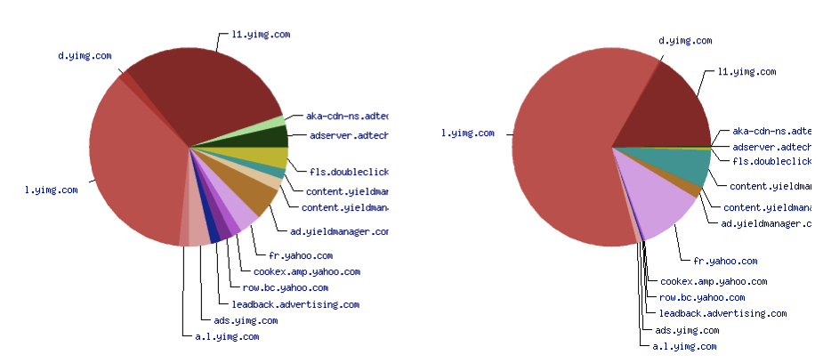
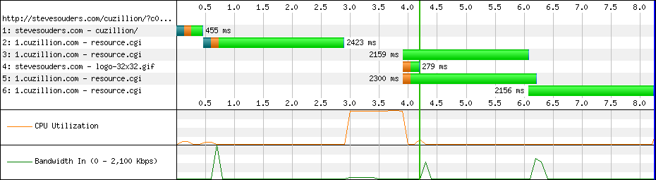
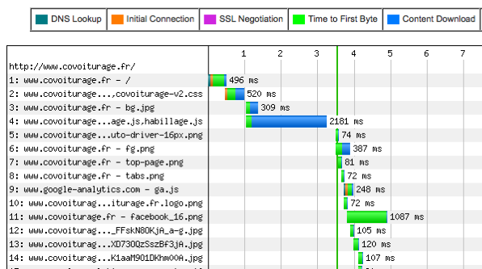

Parallélisation
===============

Nous l'avons vu dans le chapitre d'introduction aux premiers 
concepts, une session web a tendance à fortement sous-utiliser 
notre bande passante. Sur nos machines modernes, le processeur 
tourne lui aussi quasiment à vide pendant une bonne partie du 
chargement. 

La solution naturelle est de permettre au navigateur de paralléliser 
son travail, par exemple télécharger deux composants simultanément 
vu que la limitation est « par téléchargement » et non globale. 
On utilise alors mieux le processeur et la bande passante. 

On peut constater ce manque de parallélisation des navigateurs 
dans la représentation d'une session de navigation par webpagetest.org. 
Les deux courbes en bas représentent la bande passante et le processeur. 
Les lignes au dessus représentent des connexions à des serveurs 
web, et sur ces connexions les barres représentent l'activité 
réseau (les téléchargements, ou l'attente des téléchargements, 
suivant la couleur). 

On repère tout de suite dans les courbes la sous-utilisation 
du processeur et de la bande passante. La lecture de l'échelle 
de la bande passante ajoute encore à la frustration quand on se 
rends compte que la vitesse la plus importante est de 51 Kb/s. 

Sur les lignes de téléchargement on peut voir que certaines connexions 
servent peu (les premières) et que les autres ont des « trous ». 
En permettant la parallélisation dès le début on gagnerait 2,5 
secondes au départ. En évitant le trou et en permettant l'utilisation 
soutenue de toutes les connexions, on finirait là aussi environ 
2,5 secondes plus tôt. 

Au final, avec plus de parallélisation on pourrait gagner presque 
5 secondes sur les 12 secondes qu'a duré le chargement de notre 
page exemple. Si on parallélisait encore plus en augmentant 
le nombre de connexions simultanées on pourrait même aller plus 
loin. Le processeur et la bande passante disponible nous permettraient 
de le faire, à nous de nous en charger. 

Plusieurs connexions TCP par domaine
------------------------------------

Le premier palliatif au manque de parallélisation est implémenté 
dans tous les navigateurs, et même proposé par la spécification 
du protocole HTTP 1.1 : Si la bande passante est sous-occupée 
à cause des aller-retours réseaux et de la gestion TCP, il suffit 
d'ouvrir plusieurs connexions parallèles pour compenser. 
Ouvrir plus de connexions permet d'optimiser la bande passante 
mais charge plus le processeur. 

Historiquement les navigateurs ouvraient nativement deux 
connexions en parallèle par site (même nom de domaine complet). Ils pouvaient 
ainsi télécharger deux images simultanément, et exploiter 
au mieux la bande passante. Depuis, les processeurs et les débits 
ont augmentés de façon impressionnante et deux connexions simultanées 
ne suffisent plus à couvrir même la moitié de notre bande passante 
ou à occuper significativement nos processeurs. 

Les navigateurs récents et les mobiles sont tous passés à six connexions persistantes 
simultanées par domaine, sauf Opera et Internet Explorer 10 qui sont passé à huit.

+-----------------------------+-------------------------------------+
| Navigateur                  | Connexions persistantes par domaine |
+=============================+=====================================+
| Firefox                     | 6                                   |
+-----------------------------+-------------------------------------+
| Chrome                      | 6                                   |
+-----------------------------+-------------------------------------+
| Safari Mac, iOS             | 6                                   |
+-----------------------------+-------------------------------------+
| Internet Explorer 6 et 7    | 2                                   |
+-----------------------------+-------------------------------------+
| Internet Explorer 8 et 9    | 6                                   |
+-----------------------------+-------------------------------------+
| Internet Explorer 10        | 8                                   |
+-----------------------------+-------------------------------------+
| Opera                       | 8                                   |
+-----------------------------+-------------------------------------+
| Opera Mobile                | 8                                   |
+-----------------------------+-------------------------------------+
| Android 2.3                 | 8                                   |
+-----------------------------+-------------------------------------+
| Android 4                   | 6                                   |
+-----------------------------+-------------------------------------+

### Serveurs HTTP 1.0

Tous les serveurs web ne gèrent pas les connexions persistantes. 
Les navigateurs s'adaptent et peuvent s'autoriser plus de connexions 
simultanées vers ces serveurs. Firefox passe alors à quinze 
connexions simultanées dans ce cas. 

Ces comportements se déclenchent en fait dès que le serveur répond 
à l'aide de la version 1.0 du protocole HTTP, quand bien même il 
utilise la fonctionnalité keep-alive (qui a quelques spécificités 
mais qui est similaire aux connexions persistantes de HTTP 1.1). 

L'exemple d'AOL est connu sur ce sujet : Afin d'améliorer la performance 
des navigateurs visitant son site, les serveurs AOL répondaient 
toujours en HTTP 1.0, et profitaient donc immédiatement de plus 
de connexions parallèles. 

### Serveurs proxys

Les proxys déclenchent eux aussi un comportement spécifique 
des navigateurs. Comme ces derniers ne se connectent pas directement 
aux serveurs web, les problématiques de charge réseau et de charge 
serveur sont différentes. 

Firefox passe alors à huit connexions simultanées par proxy, 
tous domaines confondus, Internet Explorer 9 à douze. Suivant 
le nombre de domaines que le navigateur essaye de joindre simultanément 
via le même proxy, ça peut se révéler bénéfique ou gênant. Généralement 
le bénéfice du proxy (cache partagé) compense toutefois les 
éventuelles dégradations dues au nombre de connexions simultanées. 

### Maximum de connexions

Les navigateurs maintiennent aussi un nombre total de connexions 
parallèles tous domaines confondus. Il est entre 30 et 35 pour 
tous les navigateurs récents, sauf Android 2.3 qui limite à 4. 

### Cas particulier d'Internet Explorer sur modem RTC et VPN

Il est intéressant de noter que les versions récentes d'Internet 
Explorer tentent de détecter les connexions par modem RTC et 
par VPN. Si une de ces connexions est trouvée, le navigateur est 
alors limité à deux connexions persistantes par domaine. 

Il est possible dans ce navigateur de connaître combien de connexions 
sont utilisées à l'aide de la propriété javascript `maxConnexionsPerServer` 
de l'objet `window`. 

Plusieurs domaines en parallèle
-------------------------------

Les équipes performance de Yahoo! avaient devancé cette évolution 
des navigateurs. En 2007, quand Microsoft Internet Explorer 
6 étaient encore majoritaire, avec deux connexions persistantes 
par domaine seulement, les équipes Yahoo! ont proposé de répartir 
les ressources sur plusieurs domaines. Si les données sont réparties 
sur trois domaines, cela fait mathématiquement trois fois plus 
de connexion simultanées. 

Chaque domaine supplémentaire a un coût : Il demande une requête 
DNS, et plusieurs nouvelles connexions TCP. Il ne serait donc 
pas positif de multiplier à l'excès le nombre de domaines sur 
lesquels sont répartis les composants d'une page. 

Des tests avaient été faits à l'époque, avec une page vide comportant 
20 images de 3,4 Ko. Le temps de chargement total de la page avait 
diminué en répartissant sur deux ou trois domaines, et avait 
augmenté quand le nombre de domaines avait dépassé quatre. Leur 
recommandation était donc de toujours répartir sur plusieurs 
domaines, mais jamais plus de quatre. 

### Nombre de domaines

Depuis, les navigateurs ont augmenté leur parallélisme, aussi 
l'impact d'avoir plusieurs domaines devrait se trouver diminué, 
et l'effet négatif pourra apparaître plus vite. 

De même, Yahoo! a fait un test adapté à ses sites, dont les noms 
de domaines sont quasiment toujours dans le cache. Ce n'est probablement 
pas vrai pour vous, et dans ce cas l'effet négatif arrive encore 
une fois plus rapidement. 

À l'inverse, il est probable que votre site ait plus de 20 composants, 
et dans ce cas l'impact d'une répartition sur plusieurs domaines 
sera plus fort. 

Il est sage de se contenter de deux domaines, surtout avec les 
avancées des navigateurs récents qui parallélisent déjà très 
bien, mais même la répartition sur deux domaines devient moins 
importante qu'avant sur un site léger. 

Le nombre de domaines pertinent pour votre site devra faire l'objet 
de tests adaptés à votre cas, mais une bonne mesure peut être de 
compter le nombre de ressources, de diviser par 6 (nombre de connexions 
parallèles des navigateurs récents), puis encore par 5 ou 6 (en 
dessous de 5 requêtes que une même connexion, le coût d'ouverture 
d'une nouvelle connexion n'est pas forcément amorti). 

Cela nous donnerait le tableau suivant : 

+----------------------+-------------------------------+
| Nombre de composants | Nombre de domaines conseillés |
+======================+===============================+
| Moins de 30          | 1                             |
+----------------------+-------------------------------+
| Entre 30 et 70       | 2                             |
+----------------------+-------------------------------+
| Plus de 70           | 3                             |
+----------------------+-------------------------------+

Il convient toutefois de considérer que ce n'est qu'une première 
approximation qui vous permet ensuite de faire de vrais tests 
pour chaque valeur. 

Bien entendu, si votre site a encore beaucoup de vieux Internet 
Explorer 6 et 7, il faudra plus rapidement envisager deux ou trois 
domaines. 

À l'inverse, si votre site est sécurisé avec HTTPS, le coût d'une 
nouvelle connexion est prohibitif : N'ajoutez pas un domaine 
tant que vous avez moins de 8 à 10 requêtes par connexion. Si vous 
avez des visiteurs avec des navigateurs récents, cela veut dire 
que vous pourrez souvent rester avec un voire deux domaines. 

**Recommandation** : Sur un site standard, privilégiez la répartition 
de vos composants sur deux à trois domaines. 

### Mise en place

Ce que nous appelons domaine dans ce cadre c'est le nom complet 
de l'hôte, sous-domaine et port compris. Il est ainsi tout à fait 
possible de faire un www.example.org, www1.example.org et 
www2.example.org. 

Pour répartir vos contenus sur plusieurs domaines il est possible 
de réellement monter plusieurs domaines et de mettre les contenus 
sur l'un ou sur l'autre, suivant une règle précise. C'est indirectement 
ce qui est fait quand on utilise un réseau de diffusion de contenu 
(CDN, content delivery network). 

Plus simplement, il est possible de créer des domaines alias, 
c'est à dire pointant tous vers le même serveur, les mêmes fichiers, 
le même contexte. La seule différence sera le nom de machine utilisé 
dans l'adresse de la ressource. Côté serveur il suffit de créer 
plusieurs hôtes virtuels dans votre configuration Apache ou 
Nginx, avec la même configuration et la même destination. On 
pourra alors utiliser un domaine ou un autre, indifféremment, 
pour n'importe quelle ressource. 

Attention dans ce dernier cas d'utilisation : Si vous ne voulez 
pas annuler tout l'effet du cache HTTP (et vous ne le voulez pas, 
sinon relisez les chapitres précédents), il faut qu'une même 
ressource utilise toujours le même domaine ; ne créez pas des 
liens qui utilisent aléatoirement un domaine parmi une liste. 
Vous pouvez vous baser sur un hachage du nom de fichier, sur le 
type de fichier, sur sa source, sur sa fonction (illustration 
ou contenu), sur sa fréquence de mise à jour, ou sur n'importe 
quel critère tant qu'il ne permet pas de changer le domaine de 
l'URL tant que le fichier ne change pas. 

Pensez aussi à répartir relativement équitablement vos ressources 
sur les différents domaines, sinon vous perdrez un des intérêts 
de cette répartition. 

### Sécurité

Le fait d'utiliser des domaines tiers peut bloquer certaines 
fonctionnalités à cause des modèles de sécurité des navigateurs. 
Ainsi les contenus scriptables peuvent ne pas pouvoir interagir 
pleinement avec les contenus venant d'autres domaines, et les 
contenus protégés par des droits d'auteurs forts peuvent ne 
pas pouvoir être téléchargés sans entête HTTP particulière. 

Pour pouvoir télécharger une police de caractères sur un domaine 
tiers avec Firefox il faut que les fichiers de police envoient 
une entête HTTP `Access-Control-Allow-Origin` avec le nom 
de domaine de la page HTML comme valeur, ou `*` si l'accès est libre. 
Dans Apache cela peut se configurer comme suit : 

~~~~~~~ {.apache .partial}
<FilesMatch "\.(ttf|otf|woff)$">
    <IfModule mod_headers.c>
        Header set Access-Control-Allow-Origin "*"
    </IfModule>
</FilesMatch>
~~~~~~~

Pour que les animations Flash puissent réaliser des requêtes 
HTTP vers des domaines tiers il faudra que le domaine tiers comporte 
un fichier crossdomain.xml à la racine. Là aussi, il faut nommer 
les domaines source autorisés, ou * pour un accès libre (attention 
cela a des implications de sécurité, vous êtes encouragés à lister 
explicitement tous les domaines sources autorisés) : 

~~~~~~~ {.xml}
<?xml version="1.0"?>
<!DOCTYPE cross-domain-policy 
  SYSTEM "http://www.macromedia.com/xml/dtds/cross-domain-policy.dtd">
<cross-domain-policy> 
    <allow-access-from domain="*.example.org" />
</cross-domain-policy>
~~~~~~~

De plus, les codes javascript ne pourront pas explorer totalement 
les données venant de domaines tiers. Ainsi vous ne pourrez pas 
en javascript explorer le DOM d'une feuille de style venant d'un 
autre domaine. Vous aurez aussi des limitations pour les requêtes 
de type AJAX. 

Enfin, les feuilles de style CSS téléchargées depuis un domaine 
tiers ne pourront pas inclure de composants XBL. 

Toutes ces limitations de sécurités ne sont pas forcément limitantes, 
mais elles sont à garder à l'esprit quand vous choisirez les fichiers 
à laisser ou pas sur le domaine principal. 

Ressources bloquantes
---------------------

Nous avons augmenté le parallélisme au niveau réseau mais il 
nous reste un problème majeur : Le navigateur lui-même ne sait 
pas toujours gérer ce parallélisme. 

Certaines ressources bloquent historiquement l'activité 
réseau, le rendu, ou l'activité du navigateur. Au fur et à mesure 
des versions les navigateurs améliorent leur parallélisme 
et diminuent les goulots d'étranglement mais cela reste un problème 
pour les performances, au moins pour les navigateurs qui ne sont 
pas parfaitement à jour. 

On peut facilement constater le problème sous Microsoft Internet 
Explorer 6 en chargeant un long javascript suivi par quelques 
images : Pendant le chargement et l'exécution du javascript, 
aucune autre activité n'est réalisée par le navigateur. Au lieu 
d'être téléchargées en parallèle, les ressources sont chargées 
séquentiellement, doublant le temps nécessaire au chargement 
de la page. 

Ce comportement est aussi celui de Internet Explorer 7 et d'Opera 
au moins jusqu'à sa version 11.5. Si un script apparaît, il faudra 
attendre son téléchargement et son exécution complète avant 
de faire quoi que ce soit d'autre. 

Firefox 3.5 et Internet Explorer 8 sont un peu plus avancés puisqu'il 
savent charger plusieurs scripts et feuilles de style en parallèle 
mais le téléchargement d'images en parallèle reste impossible. 
Sur ces navigateurs il faut attendre Internet Explorer 9 et Firefox 
3.6 pour cela (Chrome, Android, Safari mobile et Safari desktop 
savent tous le gérer dans leurs versions répandues). 

Seules les versions récentes des navigateurs (Chrome 11, Firefox 
3.6, Internet Explorer 9 et Safari 5.1) savent charger en parallèle 
les images quant elles apparaissent après une feuille de style 
suivie par un script « en ligne ». Les autres navigateurs (y compris 
toutes les versions d'Opera au moins jusqu'à la 11.5) attendent 
le téléchargement complet de la feuille de style pour exécuter 
le javascript et enfin commencer à télécharger les images. 

Pour l'instant (mars 2011) aucun navigateur ne sait correctement 
gérer le parallélisme en mixant des scripts et des iframes. 

Enfin, Firefox jusqu'à la version 3.6 ne savait pas charger en 
parallèle les scripts insérés à l'aide de `document.write`. 

+-------------+----------+-----------+-----------+--------------+------------+------------------+----------+
| Navigateur  | JS // JS | JS // CSS | JS // IMG | JS // IFRAME | CSS // CSS | CSS // inline JS | Async JS |
+=============+==========+===========+===========+==============+============+==================+==========+
| Android 2.3 | O        | O         | O         | N            | Y          | N                | N        |
+-------------+----------+-----------+-----------+--------------+------------+------------------+----------+
| Android 3.0 | O        | O         | O         | N            | Y          | N                | N        |
+-------------+----------+-----------+-----------+--------------+------------+------------------+----------+
| Chrome 11   | O        | O         | O         | N            | Y          | Y                | Y        |
+-------------+----------+-----------+-----------+--------------+------------+------------------+----------+
| Firefox 3.0 | N        | N         | N         | N            | Y          | N                | N        |
+-------------+----------+-----------+-----------+--------------+------------+------------------+----------+
| Firefox 3.5 | O        | O         | N         | N            | Y          | N                | N        |
+-------------+----------+-----------+-----------+--------------+------------+------------------+----------+
| Firefox 3.6 | O        | O         | O         | N            | Y          | N                | Y        |
+-------------+----------+-----------+-----------+--------------+------------+------------------+----------+
| Firefox 4.0 | O        | O         | O         | N            | Y          | Y                | Y        |
+-------------+----------+-----------+-----------+--------------+------------+------------------+----------+
| IE 6 et 7   | N        | N         | N         | N            | Y          | N                | N        |
+-------------+----------+-----------+-----------+--------------+------------+------------------+----------+
| IE 8        | O        | O         | N         | N            | Y          | N                | N        |
+-------------+----------+-----------+-----------+--------------+------------+------------------+----------+
| IE 9        | O        | O         | O         | N            | Y          | Y                | Y        |
+-------------+----------+-----------+-----------+--------------+------------+------------------+----------+
| Iphone 4.3  | O        | O         | O         | N            | Y          | N                | N        |
+-------------+----------+-----------+-----------+--------------+------------+------------------+----------+
| Opera 11.5  | N        | N         | N         | N            | Y          | N                | N        |
+-------------+----------+-----------+-----------+--------------+------------+------------------+----------+
| Safari 6    | O        | O         | O         | N            | Y          | N                | N        |
+-------------+----------+-----------+-----------+--------------+------------+------------------+----------+

[Browserscope](http://www.browserscope.org/?category=network) 
liste les fonctionnalités de chaque navigateur au regard de 
ces critères (et d'autres). Il est normalement tenu à jour assez 
rapidement après la sortie d'une nouvelle version. 

Positionner le code javascript
------------------------------

La première recommandation pour palier le problème de parallélisation 
des scripts est de faire attention à leur placement dans le corps 
de la page. Pour cela on distingue les scripts embarqués dans 
la page (« inline ») et les scripts externes. 

### Code javascript embarqué dans la page

Les codes embarqués, s'ils sont exécutables presque instantanément, 
devraient être placés le plus haut possible dans le `<head>`, 
avant les références vers les feuilles de style et les autres 
javascript. Placés en haut avant toute autre référence ils n'imposeront 
aucun téléchargement séquentiel avant de charger les composants 
de la page. 

Attention, si les scripts embarqués dans le `<head>` apparaissent 
après la déclaration des feuilles de style, ils risqueront d'empêcher 
la parallélisation sur une majorité de navigateurs (à l'heure 
actuelle, tous sauf Firefox 4 et Internet Explorer 9). 

À l'inverse, si ces scripts embarqués sont lents à exécuter, 
alors il faudra privilégier un positionnement tout en bas de 
la page, juste avant la fermeture du `</body>`. Ainsi, le contenu 
complet de la page sera accessible avant que l'effet négatif 
du script soit perçue. 

Les cas entre lent et instantané à exécuter dépendent du contexte, 
mais il est en général plus sûr de déléguer l'exécution à la fin 
de la page en cas de doute : Le haut de page est très sensible car 
tout délai laissera une page blanche ou la page précédente plus 
longtemps à la vue de l'utilisateur, provocant un ressenti très 
négatif. 

### Code javascript externe ou à exécution lente

Les scripts externes (dans des fichiers séparés) sont par nature 
lents. Dans le meilleur des cas, sur un site grand public, c'est 
de 50 millisecondes grand minimum pour un petit script avec une 
faible latence à plus d'une seconde pour un gros jquery monolithique. 

Pendant ce temps, Opera et Internet Explorer 7 bloquent toute 
activité. Pour ces navigateurs, un script qui met une seconde 
à se charger c'est une page dont le chargement est ralenti d'autant. 

Les autres navigateurs savent paralléliser les téléchargements 
suivants (images et autres fichiers javascript) mais le rendu 
s'arrête le temps que notre fichier soit téléchargé et exécuté. 

Pour éviter ces désagréments on conseille donc d'inclure l'essentiel 
des scripts externes en bas de page, juste avant la fermeture 
du `</body>`, avec le même objectif que pour les scripts lents 
embarqués directement dans la page. 

Placer les scripts en fin de page
---------------------------------

Quand on propose de déporter le javascript en fin de page la réaction 
est souvent une réaction de rejet. On n'imagine pas une page sans 
javascript et on craint de donner une mauvaise expérience à l'internaute. 

Pourtant, nous avons un fait essentiel qui soutient notre objectif 
: L'utilisateur cherche à utiliser en premier lieu le contenu 
textuel et graphique avant de tenter d'interagir avec les enrichissements 
javascript ou de profiter des animations. 

Ce que nous cherchons donc à faire ici n'est pas d'accélérer le 
chargement de la page, mais uniquement de faire arriver à l'écran 
le plus important le plus tôt possible : prioriser. En fait il 
se peut même que le chargement complet de la page soit légèrement 
plus long, mais nous considérons quand même cela comme un bénéfice 
si la page affichée à l'utilisateur est exploitable entre temps. 
C'est tout l'objectif de déporter le javascript en fin de page. 

**Recommandation** : Placez les codes javascripts externes 
ou lents en fin de page, juste avant la fermeture de la balise `</body>`. 

### Rendre la page fonctionnelle en attendant javascript

Malheureusement pour nous, les sites sont de plus en plus en dépendance 
forte avec javascript. Pour mettre en œuvre notre recommandation 
d'injecter le javascript uniquement à la fin de la page, il faut 
respecter une bonne pratique d'accessibilité : d'abord construire 
la page, utilisable sans javascript, et ajouter les enrichissements 
seulement ensuite. 

Il nous faudra toutefois éviter qu'un enrichissement dépendant 
de javascript ne soit utilisé avant qu'il ne soit fonctionnel. 
Trois options sont possibles : 

#### Cacher la fonctionnalité lors de l'attente

La première est de cacher la fonctionnalité tant qu'elle n'est 
pas complète. On utilisera cela pour les fonctionnalités annexes 
qui ne manqueront pas à l'utilisateur et dont l'apparition différée 
ne choquera pas l'utilisateur. Le cas parfait pour cette option 
est le carrousel : Par défaut seul le premier item du carrousel 
s'affiche. L'interface semble fonctionnelle, l'utilisateur 
se retrouve juste avec un seul visuel. 

Une fois le javascript disponible, c'est là que les autres visuels 
sont téléchargés en tâche de fond et que l'animation commence. 
Si c'est bien réalisé, l'utilisateur ne se rendra même pas compte 
que le chargement se fait en deux temps. Seul le fait que le premier 
visuel reste plus longtemps à l'écran la première fois permet 
de déceler l'astuce. 

Le fait que les animations n'attirent pas immédiatement la vue 
mais seulement après un certain temps pourra même être vu comme 
une amélioration de l'expérience utilisateur. Outre les carrousels, 
ce fonctionnement est parfait pour tous les contenus qui ne manquent 
pas vraiment s'ils sont absents : les auto-complétions par exemple. 
On peut les utiliser aussi pour les contenus annexes et peu visibles 
dans les colonnes à droite ou à gauche du contenu principal. 

#### Attente lors de l'activation de la fonctionnalité

La seconde option est d'afficher tout ce qui sera utilisable 
à terme par l'utilisateur. C'est seulement quand on voudra cliquer 
sur un bouton ou agir avec cette interface qu'un visuel d'attente 
sera affiché, le temps de finir de télécharger tout le code nécessaire. 

On utilise ce mécanisme pour les animations et les interfaces 
au centre de l'écran ou qui sont essentielles à l'utilisateur, 
quand il n'est pas envisageable de les masquer par défaut ou de 
les faire apparaître à l'écran par la suite. 

C'est par exemple cette solution qu'on trouvera derrière les 
boutons « retirer le produit de la commande et recalculer le prix 
à payer » d'un récapitulatif de commande. Il est nécessaire pour 
l'utilisateur d'avoir immédiatement accès au bouton et d'en 
connaître la présence, par contre il est envisageable d'attendre 
un court instant une fois qu'on tente de faire une opération. 
Là aussi, il est probable que l'utilisateur ne se rende pas compte 
de l'astuce s'il n'utilise pas immédiatement le bouton. Nous 
avons donc tout à y gagner. 

Réaliser cet effet demande un investissement plus lourd que 
la méthode précédente puisqu'il faut exécuter un très court 
javascript en ligne dans le `<head>` (quelques lignes) afin 
d'activer ce comportement d'attente, puis détecter si un clic 
est en attente ou pas quand le javascript réel s'exécute en fin 
de page. 

#### Attente lors de l'affichage de la fonctionnalité

La troisième option c'est afficher directement un visuel d'attente 
à la place, à côté ou par dessus l'interface dont le javascript 
est en train de se télécharger. Ce peut être une image animée, 
une barre de chargement, ou simplement un bouton grisé et désactivé. 
Le visuel d'attente est ensuite supprimé quand le code javascript 
nécessaire est enfin entièrement chargé. 

Parce qu'elle montre à l'utilisateur que la page est encore en 
train de se charger, on réserve l'utilisation de cette option 
aux fonctionnalités qui constituent le contenu principal de 
la page : un player vidéo par exemple. 

#### Choisir comment vivre l'attente

Aucune de ces options n'est parfaite, et elles représentent 
toutes trois un compromis différent suivant le rôle et la place 
de la fonctionnalité javascript. Gardez toutefois à l'esprit 
que l'alternative c'est que votre page ne s'affiche pas du tout 
(page blanche ou attente sur la page précédente), ou à moitié 
(contenu haut et gauche, sans la barre de droite, le bas et plusieurs 
images) pendant ce temps. 

Quitte à attendre, offrez à vos utilisateurs le maximum, qu'ils 
puissent au moins avoir accès à une page visuellement propre 
et complète avec le reste des contenus et de la navigation. Son 
attente n'en sera que meilleure. 

### Prévoir l'arrivée des scripts : éviter les pages qui bougent

Afin de réaliser des pages qui fonctionne avec et sans javascript, 
il vous est conseillé d'utiliser un mécanisme d'enrichissement. 
Il s'agit de réaliser d'abord une page fonctionnelle sans javascript, 
puis de modifier le DOM avec javascript pour obtenir l'effet 
souhaité. Si les deux interfaces, avec et sans, diffèrent visuellement, 
l'effet peut être gênant pour l'utilisateur. C'est encore plus 
vrai si les scripts sont exécutés en fin de page puisque la page 
« sans javascript » sera donc affichée plus longtemps. 

Il est alors nécessaire de prévoir si la page exécutera ou non 
les scripts pour lui faire afficher directement la bonne mise 
en page. Pour cela on utilise généralement un script « en ligne 
», directement embarqué dans le `<head>` de la page HTML, qui 
se contente d'ajouter une classe nommée « js » à la balise racine 
`<html>`. 

~~~~~~~ {.oneline .html .partial}

~~~~~~~

La feuille de style pourra alors prévoir les deux cas, avec ou 
sans javascript, et afficher immédiatement la mise en forme 
la plus proche possible de la mise en forme finale. 

Pour illustrer notre propos on peut prendre l'exemple d'une 
page avec des résultats sportifs. Sans javascript ces résultats 
sont présentés sous forme de plusieurs tableaux, un pour chaque 
poule, placés les uns en dessous des autres. 

Avec javascript nous souhaitons avoir une mise en page plus agréable 
sous forme d'onglets de façon à optimiser l'espace de la page. 

Il est possible de passer de l'un à l'autre avec uniquement des 
règles CSS. Les onglets supplémentaires (ici « résultats » et 
« à venir ») ne seront pas utilisables directement. Pour passer 
sur ces onglets il faudra attendre le chargement complet de Javascript 
mais l'utilisateur ne s'en apercevra probablement pas : Il s'agit 
d'un contenu annexe sur lequel l'utilisateur n'ira pas forcément 
cliquer en moins de quelques secondes. Si besoin on peut toutefois 
enregistrer un mécanisme d'attente comme décrit plus tôt. 

Par contre, il ne subira pas l'expérience désagréable qu'aurait 
été de voir tous les onglets dépliés pendant quelques secondes 
avant de les voir se replier sous ses yeux faisant totalement 
changer la forme générale de la page. 

Charger Javascript en asynchrone
--------------------------------

Plus que simplement déporter le javascript en bas de page, il 
existe aussi des techniques pour que les fichiers soient chargés 
de façon asynchrone, en parallèle des autres composants, sans 
bloquer le rendu de la page. 

Toutes ces techniques ont un coût, soit en complexité soit en 
compatibilité. Il vous est recommandé de répondre en premier 
à la recommandation précédente et de placer un maximum de javascript 
en bas de page. C'est particulièrement vrai si vous avez des fichiers 
de forte taille puisque même chargés en asynchrone ils continueront 
d'occuper vos files de téléchargement et d'empêcher le navigateur 
d'afficher le reste des composants. 

Sur l'exemple covoiturage.fr, retirer l'aspect bloquant du 
gros javascript (quatrième composant) permettrait d'avancer 
l'affichage de tous les autres composants de plus de deux secondes. 

### Fonctionnement natif des navigateurs

Outre le comportement natif des navigateurs récents qui savent 
paralléliser correctement le chargement des fichiers javascript, 
nous avons plusieurs techniques à notre disposition pour éviter 
de bloquer le rendu. 

#### Defer et async

Depuis longtemps Microsoft Internet Explorer accepte un attribut 
nommé « defer » sur les balises ` 
~~~~~~~

L'attribut « async » est lui tout nouveau, arrivé aussi avec HTML 
5. Le téléchargement du fichier est initié immédiatement et 
le script sera exécuté dès que possible (à la fin du téléchargement), 
mais le navigateur est informé qu'il doit continuer l'analyse 
et le rendu du reste de la page en attendant. Les scripts étant 
chargés de façon asynchrone, l'ordre d'exécution n'est plus 
assuré : Il dépend de l'ordre de fin de téléchargement, qui ne 
peut être prévu avec certitude. 

~~~~~~~ {.html .partial}

<!-- rien ne garantit que le script 1 s'exécutera toujours avant le script 2 -->
~~~~~~~

Dans les deux cas, il faudra porter la plus grande attention aux 
dépendances entre vos codes javascript : Si jQuery est chargé 
avec l'attribut async, rien ne garantit que jQuery sera bien 
initialisé quand vous tenterez de l'utiliser dans une autre 
balise `

~~~~~~~

on pourra l'englober dans une iframe de la façon suivante :

~~~~~~~ {.html .partial}
<iframe src="about:blank" seamless srcdoc="
  
  
">
</iframe>
~~~~~~~

Malheureusement, l'attribut `srcdoc` n'est pris en charge que par certains
navigateurs modernes. Il convient donc de prévoir un mécanisme par défaut
pour les autres navigateurs. Il consistera à ajouter ces quelques lignes juste
après l'iframe pour revenir à un `document.write` en l'absence de prise en
charge de `srcdoc` :

~~~~~~~ {.html .partial}

~~~~~~~
