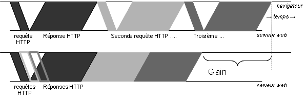

Réduire les espaces vides
=========================

CDN
---

**@TODO**

Keep-alive
----------

**@TODO**

Le pipelining HTTP
------------------

Le pipelining HTTP (qu'on pourrait traduire plus ou moins par 
enfilage HTTP) est une fonctionnalité prévue dans la version 
1.1 de HTTP. Bien que cette version soit celle utilisée par quasiment 
tous les serveurs web et tous les navigateurs, le pipelining 
lui-même est peu implémenté. 

Il s'agit simplement d'autoriser le navigateur à enchaîner 
les requêtes HTTP sur un même fil TCP sans attendre la réponse 
correspondante. On évite alors la perte de temps due à la latence 
entre chaque requête (le temps entre l'envoi du dernier octet 
de la réponse par le serveur et celui de la réception du dernier 
octet de la requête HTTP suivante. 

Malheureusement tous les serveurs web et tous les proxy ne supportent 
pas bien ce mode d'accès et il est difficile ou impossible de le 
détecter à l'avance. Mozilla Firefox sait utiliser le pipelining 
mais il reste désactivé par défaut pour compatibilité (on peut 
l'activer manuellement dans la page about:config). Seul Opéra 
et Firefox Mobile l'activent par défaut, avec un mécanisme pour 
tenter d'éviter de l'utiliser sur des serveurs potentiellement 
incompatibles. Ils maintiennent une liste noire fixe des serveurs 
à éviter et une liste dynamique basée sur les comportements constatés 
par le navigateur par le passé. Des réflexions sont toutefois 
menées pour améliorer l'utilisation du pipelining à l'avenir. 

De plus, ce mécanisme peut aussi ralentir le chargement des pages 
: Le navigateur télécharge en réalité les composants sur plusieurs 
fils TCP en parallèle. Un peu comme les queues au supermarché, 
si on se contente de regarder le nombre de personnes en attente 
(le nombre de requêtes) par queue sans regarder le remplissage 
des chariots (la taille des composants à télécharger), on peut 
finalement attendre plus longtemps que prévu. Ici il n'est pas 
possible de déterminer à l'avance la taille des composants à 
télécharger (le remplissage des chariots) ou de changer de queue 
en cours de route. Ainsi, il est possible qu'un téléchargement 
soit en attente sur un fil TCP alors même que les autres fils TCP 
n'ont plus aucune activité. 

Support navigateur : http://www.blaze.io/technical/http-pipelining-request-distribution-algorithms/ 

Le protocole SPDY
-----------------

SPDY (à prononcer en anglais comme « speedy », « rapide » en anglais) 
est une évolution du protocole HTTP créée par Google. Cette couche 
intermédiaire entre HTTP et TCP offre plusieurs fonctionnalités 
et en particulier : 

* la possibilité d'utiliser un même fil TCP pour multiplexer 
  plusieurs requêtes/réponses simultanées, optimisant ainsi 
  la bande passante ; 

* la possibilité de conseiller le navigateur dès les entêtes 
  sur les ressources qu'il devrait charger sans attendre ; 

* la possibilité pour le serveur d'envoyer des contenus de sa 
  propre initiative s'il est extrêmement probable que le client 
  en aura besoin ; 

* la compression des entêtes HTTP. 

Il est possible d'avoir plus de détails sur le protocole SPDY 
sur les serveurs du projet Chromium (moteur du navigateur de 
Google Chrome) à l'adresse [http://www.chromium.org/spdy/](http://www.chromium.org/spdy/). 

Les trois premières fonctionnalités, indépendamment, permettent 
entre autres d'optimiser les échanges et de supprimer les effets 
de la latence réseau dans le téléchargement de plusieurs composants 
sur un même serveur. Ces mécanismes demandent toutefois une 
plus grande intelligence (et donc une plus grande complexité) 
et du serveur web et du navigateur web. 

Pour l'instant le protocole est à l'état de proposition et n'est 
pour l'instant implémenté (partiellement) que par le navigateur 
Google Chrome et par les serveurs web de Google. Un module pour 
le serveur web Apache est toutefois en développement sur [http://code.google.com/p/mod-spdy/](http://code.google.com/p/mod-spdy/). 

----

**@TODO**